<p align="center">
  
</p>

<h1 align="center">Chaff</h1>

<p align="center">
  A desktop app for reviewing what Claude Code and Codex wrote, one stack of branches at a time.<br />
  <a href="https://catofjupit3r.github.io/chaff/">Project page</a> · <a href="#install">Install</a>
</p>

<picture>
  <source media="(prefers-color-scheme: dark)" srcset="docs/screenshots/full-diff-split-dark.png" />
  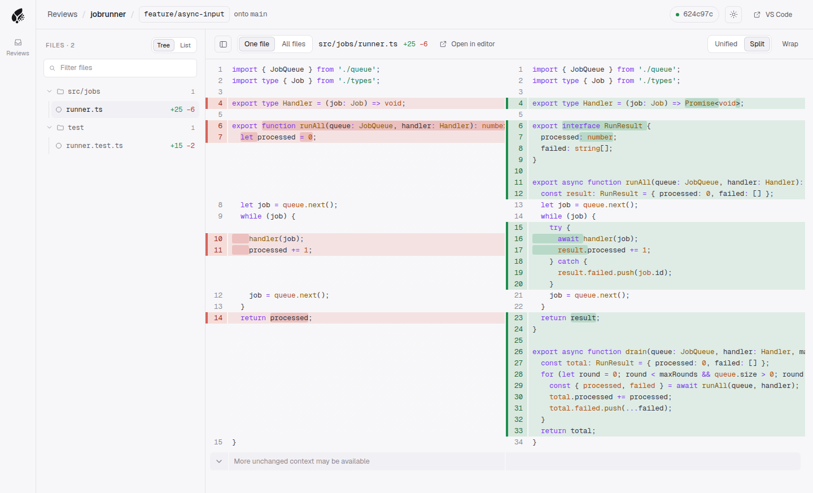
</picture>

Agents write code faster than anyone can read it, and it usually arrives as a stack of branches or merge requests that build on each other (`main <- A <- B <- C`). Chaff reads those branches straight from the repository on your computer, freezes the one you're reviewing so a new push can't move the code under you, and shows each branch's own changes against its parent.

> **Status:** early. Most of it works and gets used for real reviews, but things still move around, sometimes a lot. The full list is in [What works today](#what-works-today).

## Why

I review a lot of code from Claude Code and Codex, and doing it in GitLab and GitHub was miserable:

- **Stacks are shown one MR at a time.** A feature arrives as ten small branches, each on its own page. By MR 6 I'm opening tabs to find out which one added that helper.
- **The MR viewers are slow.** Big diff: "Load diff". Bigger diff: "This diff is too large to display". Click a file, wait, scroll, it collapses again.
- **The code moves while I read.** The agent pushes, the page reloads, and my place and the "viewed" checkboxes are gone.
- **"Fixed" is a claim, not a fact.** I leave a comment, the agent says it's done, and I get to dig through force-pushes to check.

Chaff doesn't review anything for you, and it never decides what's resolved. It lets you read at the level that helps (a whole change, one function, or a few lines), write down a concern in one keystroke, remembers what you looked at and at which commit, and after the agent pushes, brings you back only to what changed.

## How it works

1. **Add a repository.** Pick a folder on disk. Chaff reads it with your own `git` and never writes to it: no checkouts, no new refs, no stash.
2. **Build the stack.** Start a stack from the branch you want to review, then add the branch it merges into and the ones built on top of it. Chaff suggests them from history (the branches with the fewest commits in between), so `feature/async-input <- feature/job-options <- feature/consent` takes a few clicks. With GitLab or GitHub connected, merge request chains come in as suggestions too. Chaff remembers each parent, so a new commit on a lower branch keeps the stack together and marks the branches above it **parent moved** until they are rebased.
3. **Start a review, and Chaff freezes a snapshot.** The branch, its parent and their merge base are fetched into Chaff's own bare repository and pinned, so rebasing, amending or deleting the branch does not break the review.
4. **Chaff splits the change into regions and units.** Every changed range is a region with a stable id. Tree-sitter maps regions to the functions, methods and classes that own them (Function units); everything else (imports, config, deleted or generated files) becomes a Section unit, so nothing falls through.
5. **You read the diff in reading order.** Types and contracts come first, tests sit next to the code they test, and config, docs and generated files come last.
6. **When the branch moves, Chaff tells you and leaves your code alone.** New commits, a rewritten branch or a moved parent show up next to the snapshot, and **Update** freezes a new one when you are ready.
7. **The second pass only shows what changed.** Decisions on unchanged units carry over, edited units show what changed since you decided, and every finding is looked for again in the new code so you can verify the fix.

[docs/how-it-works.md](docs/how-it-works.md) goes deeper: the architecture, the snapshot store, regions and units, and where Chaff keeps its data.

## Tour

### Reviews

Your repositories and their stacks. Paste a merge request link, `!412`, or a branch name into the box at the top to start a review, click a branch in the chain to review it against its parent, or **Continue** where you left off.

<picture>
  <source media="(prefers-color-scheme: dark)" srcset="docs/screenshots/reviews-dark.png" />
  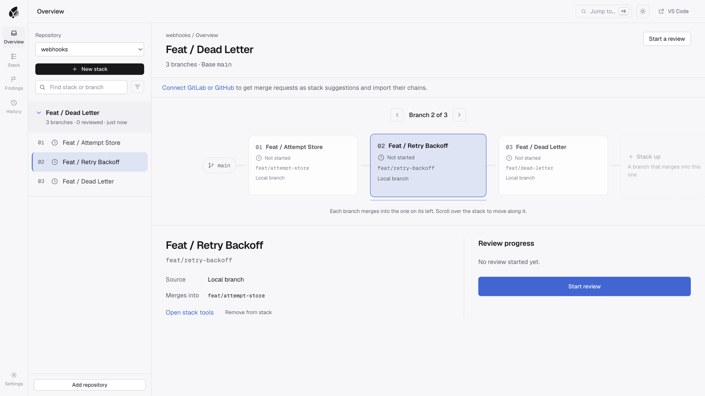
</picture>

### Stack overview

The whole stack top to bottom, each branch with its decisions so far, and the selected branch beside it: its parent (confirm Chaff's suggestion or pick another), what moved since your snapshot, its units, and the branches that build on it. **Cumulative from main** reviews everything from the stack's base to this branch in one pass.

<picture>
  <source media="(prefers-color-scheme: dark)" srcset="docs/screenshots/stack-overview-dark.png" />
  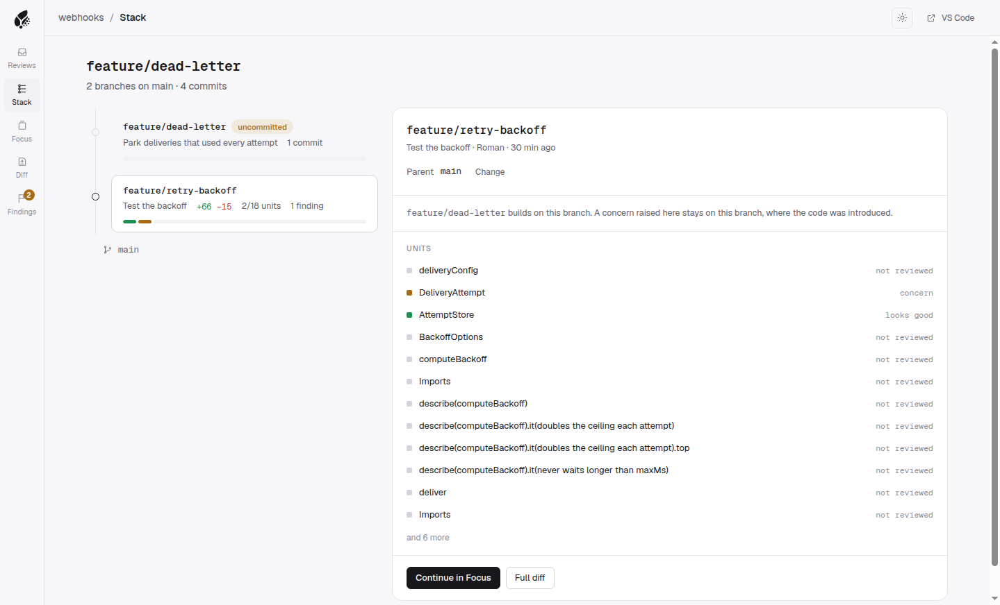
</picture>

### Working changes

A branch checked out with uncommitted work gets an **uncommitted** tag. **Review working changes** copies the files into Chaff's own store as a snapshot on top of the branch, so you can read what the agent has not committed yet. Your files, index and stash stay as they were.

<picture>
  <source media="(prefers-color-scheme: dark)" srcset="docs/screenshots/stack-working-changes-dark.png" />
  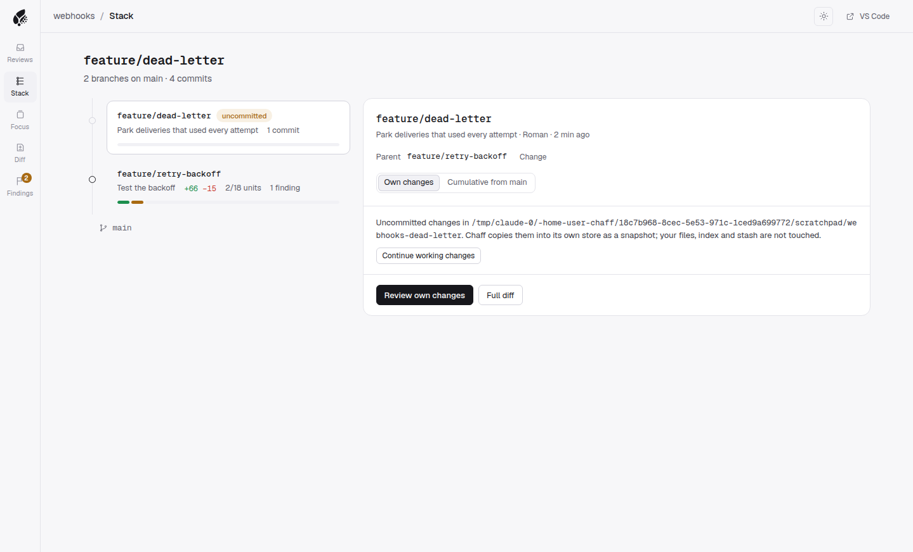
</picture>

<picture>
  <source media="(prefers-color-scheme: dark)" srcset="docs/screenshots/focus-working-changes-dark.png" />
  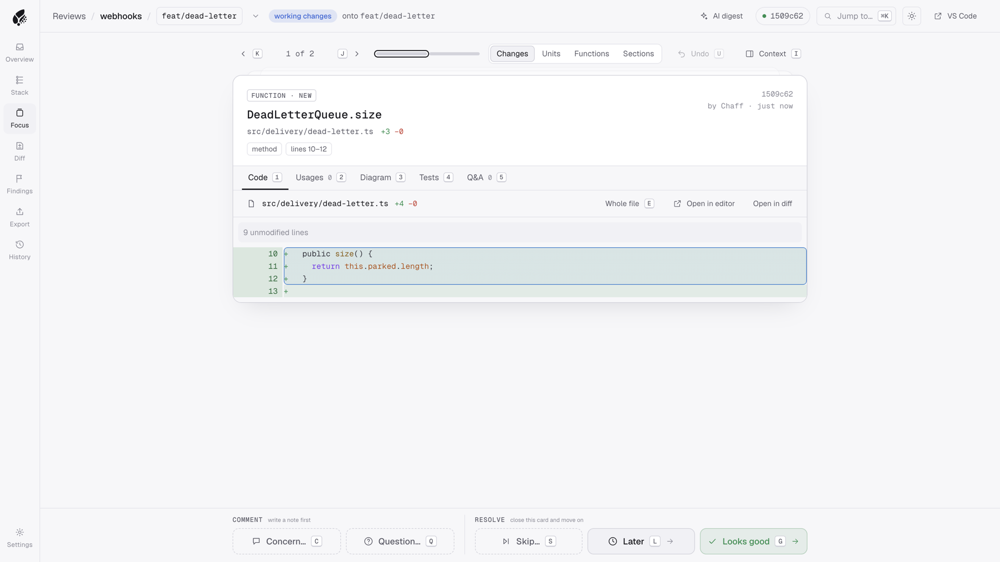
</picture>

### Focus review

One unit at a time: a function, a type or a section of a file, shown whole with its changes marked, the commit that last touched it, and the places that use it. Resolve the card with **Looks good** (G) or **Later** (L), or write a **Concern** (C) or **Question** (Q) and keep reading. Notes become findings pinned to the code. **U** undoes, **I** opens the list of every unit, and the last card tallies what you decided and walks you through the ones you put off.

<picture>
  <source media="(prefers-color-scheme: dark)" srcset="docs/screenshots/focus-dark.png" />
  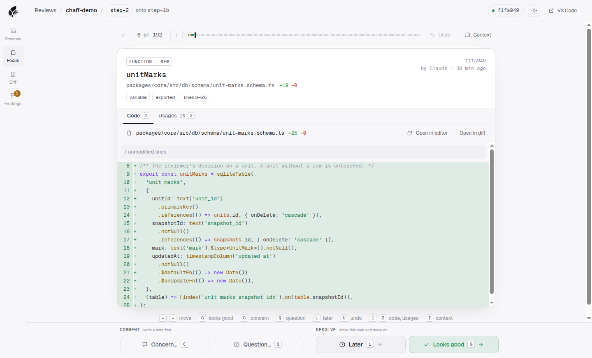
</picture>

<picture>
  <source media="(prefers-color-scheme: dark)" srcset="docs/screenshots/focus-note-dark.png" />
  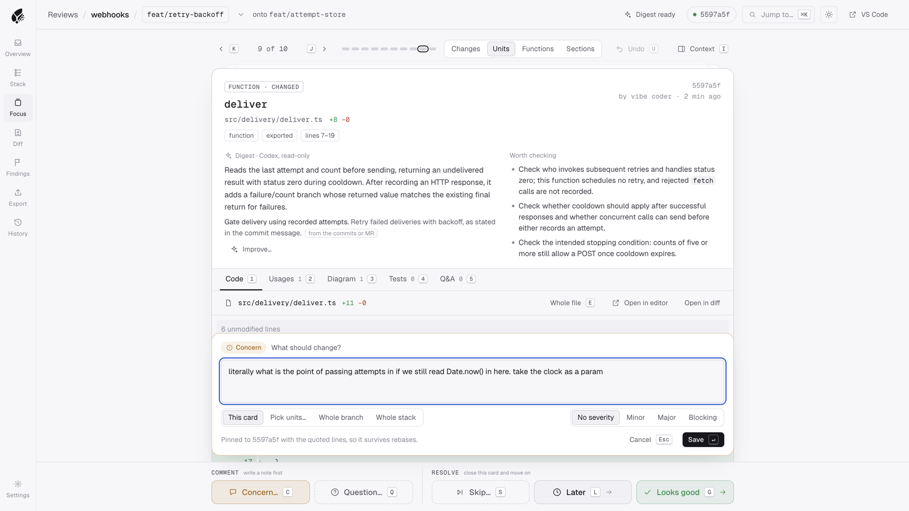
</picture>

Cards come in three progressions, picked above the card. **Changes** shows each Change unit (one behavior or design change, often across files) as a single card with all of its code, then every unit no change covers. A decision on a Change card applies to all of its units, so progress is still counted unit by unit. **Functions** and **Sections** walk one kind of unit only. The digest's groups become the Change units when it finishes, and **Edit changes** lets you make your own, split one by taking some of its units into a new change, merge, rename, reorder or ungroup them. Change units carry over to the next version of the review.

<picture>
  <source media="(prefers-color-scheme: dark)" srcset="docs/screenshots/focus-change-dark.png" />
  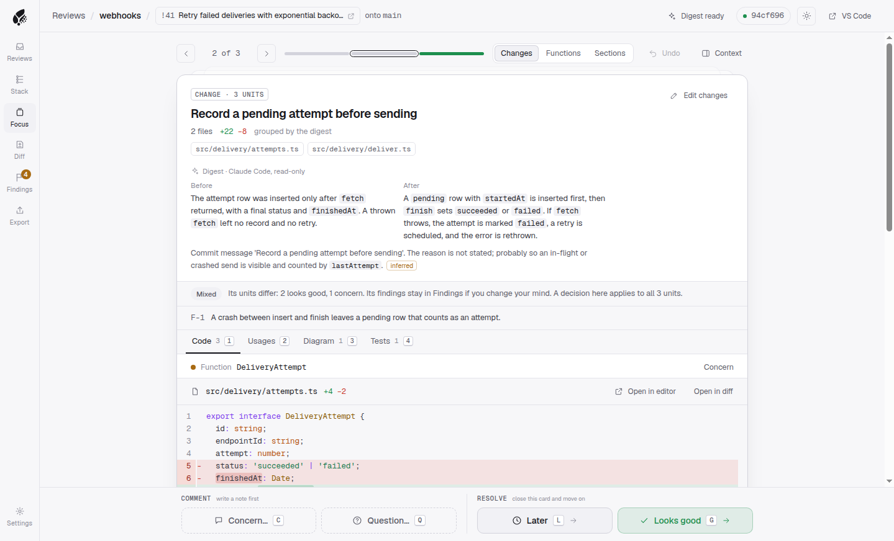
</picture>

<picture>
  <source media="(prefers-color-scheme: dark)" srcset="docs/screenshots/change-editor-dark.png" />
  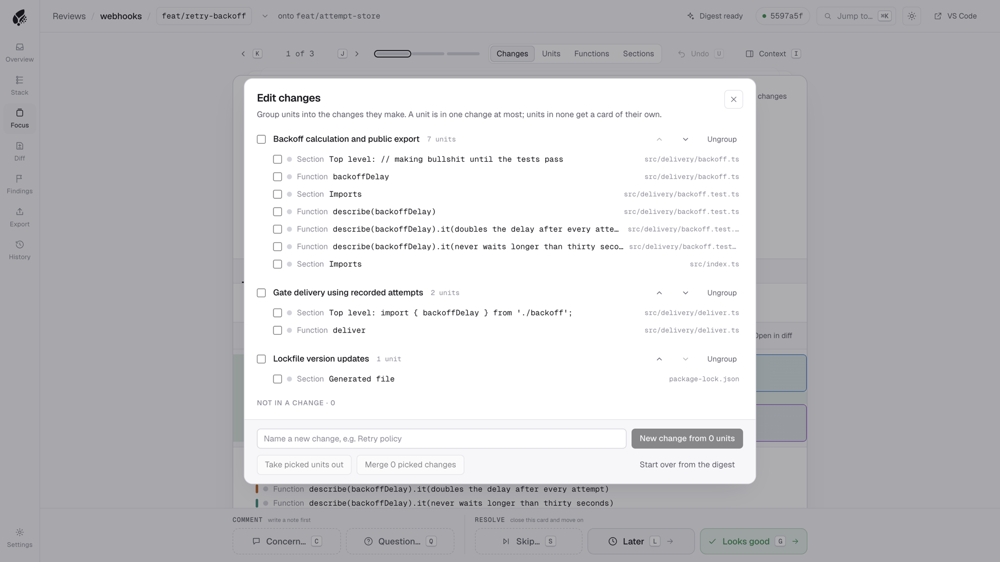
</picture>

A unit that doesn't need reading (an import shuffle, a lockfile) can be skipped with **S** and a short reason, such as "imports only". Skipping counts as accounted for, and the reason goes into the export, so the agent knows what nobody read. In the Full diff, **Skip…** next to a file does the same for every undecided unit in it. A review is complete once every region is in a unit you decided on or skipped; the Reviews and Stack screens count progress in regions, and the last card says so.

<picture>
  <source media="(prefers-color-scheme: dark)" srcset="docs/screenshots/focus-skip-dark.png" />
  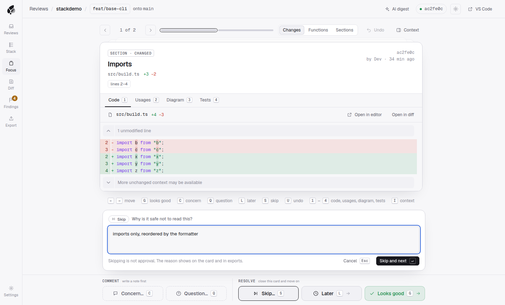
</picture>

<picture>
  <source media="(prefers-color-scheme: dark)" srcset="docs/screenshots/focus-complete-dark.png" />
  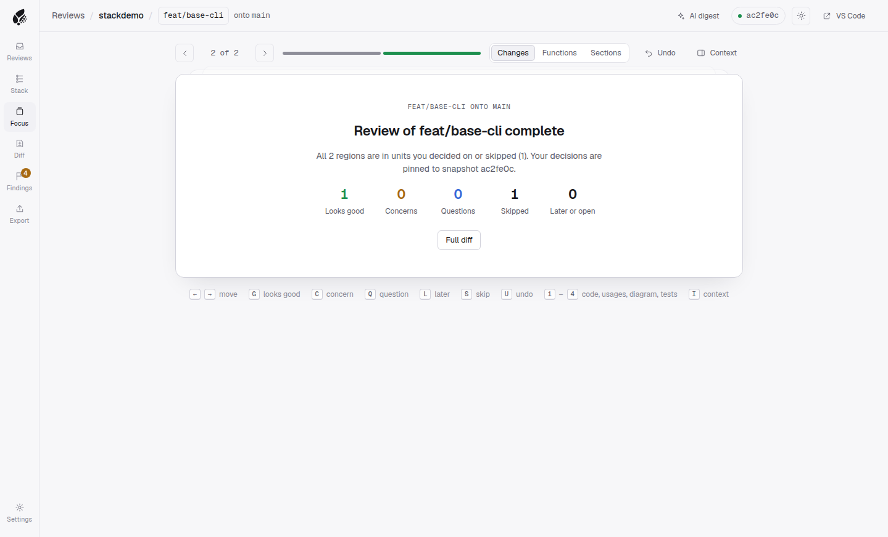
</picture>

On a touch screen or with a pen, swipe the card: right is **Looks good**, left starts a **Concern**. The border turns green or amber once letting go will decide; a short drag slides back. A mouse keeps selecting code.

<picture>
  <source media="(prefers-color-scheme: dark)" srcset="docs/screenshots/focus-swipe-dark.png" />
  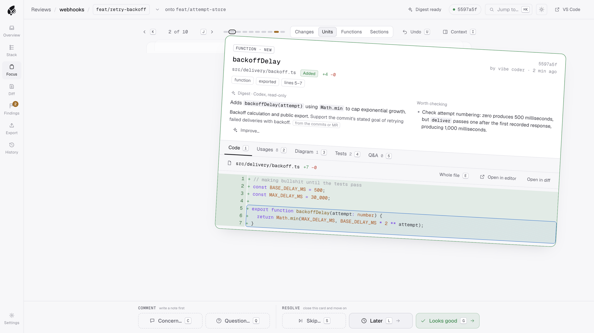
</picture>

### AI digest

Chaff can ask the coding agent already on your computer (Claude Code or Codex) to read the branch first. The agent works in a throwaway, read-only copy of the snapshot, with read and search tools only, and Chaff checks its answer before keeping it. In Focus, every card then gets a summary and a short "Worth checking" list, why the change was made (marked as taken from the commits and merge request or inferred), the tests that cover the unit, and a diagram where one helps; a box in the diagram that stands for a unit opens that unit's card. With Claude Code the overview and groups show in the context panel while the agent is still writing. Its groups become the Change units you review in the Changes progression, and the cards follow the digest's reading order. Nothing in the digest decides anything for you: every unit still waits for your call, and units the digest could not explain land in a visible "Other changes" group.

<picture>
  <source media="(prefers-color-scheme: dark)" srcset="docs/screenshots/focus-digest-dark.png" />
  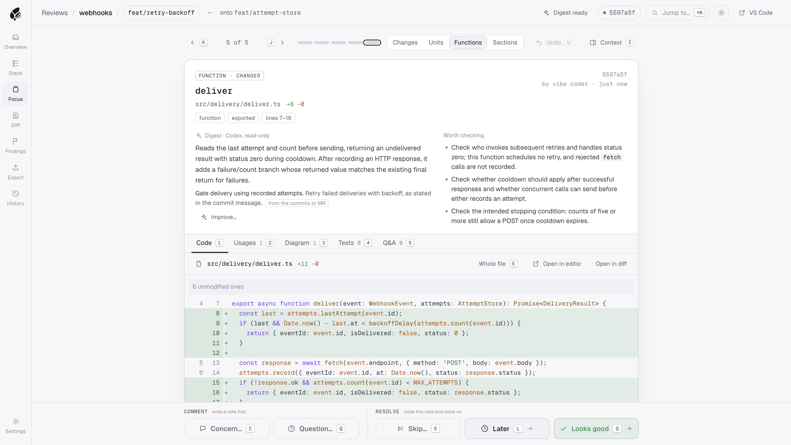
</picture>

<picture>
  <source media="(prefers-color-scheme: dark)" srcset="docs/screenshots/digest-context-dark.png" />
  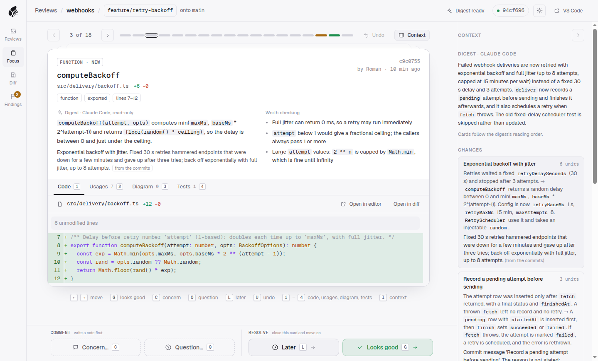
</picture>

<picture>
  <source media="(prefers-color-scheme: dark)" srcset="docs/screenshots/focus-diagram-dark.png" />
  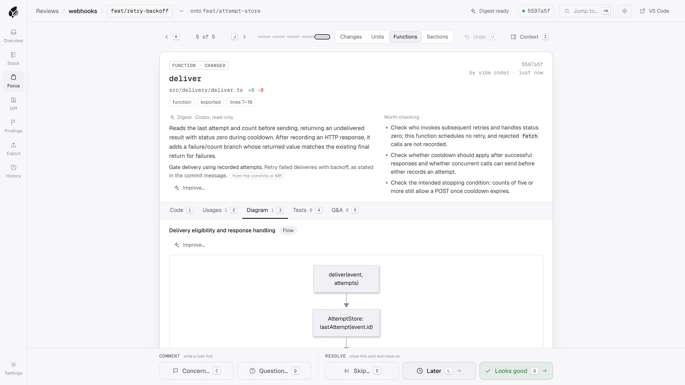
</picture>

<picture>
  <source media="(prefers-color-scheme: dark)" srcset="docs/screenshots/focus-diagram-links-dark.png" />
  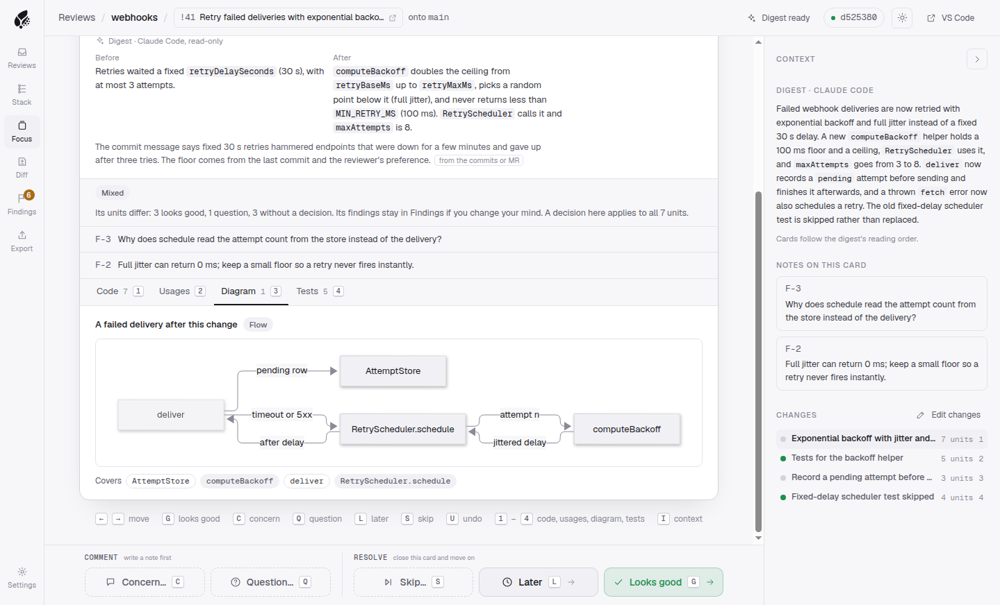
</picture>

<picture>
  <source media="(prefers-color-scheme: dark)" srcset="docs/screenshots/digest-streaming-dark.png" />
  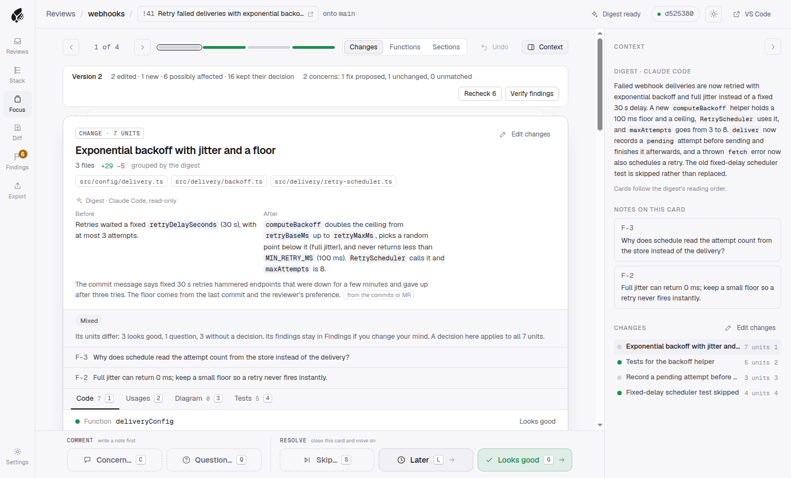
</picture>

The Tests tab keeps three facts apart: a test exists, the agent read it, and it passed. Chaff never runs tests, so a digest can't claim the third. Without a digest, the tab lists the test files that mention the unit by name.

<picture>
  <source media="(prefers-color-scheme: dark)" srcset="docs/screenshots/focus-tests-dark.png" />
  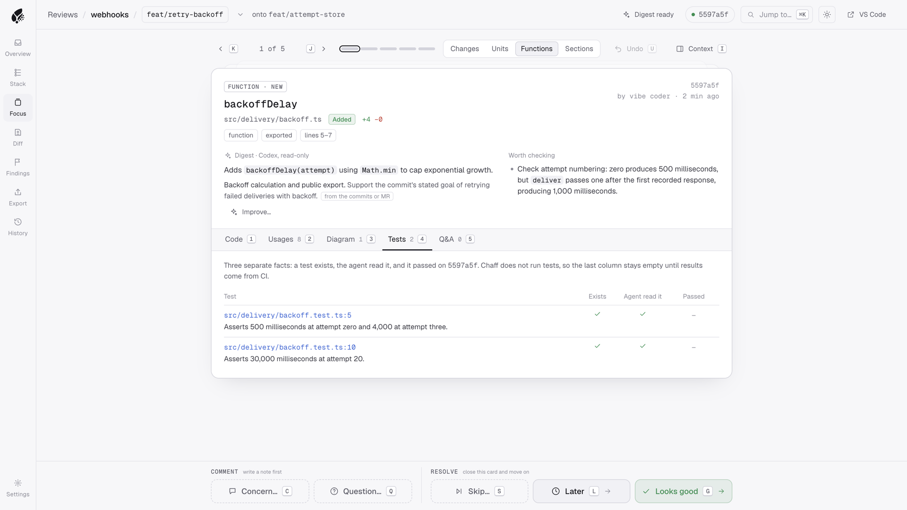
</picture>

<picture>
  <source media="(prefers-color-scheme: dark)" srcset="docs/screenshots/focus-tests-found-dark.png" />
  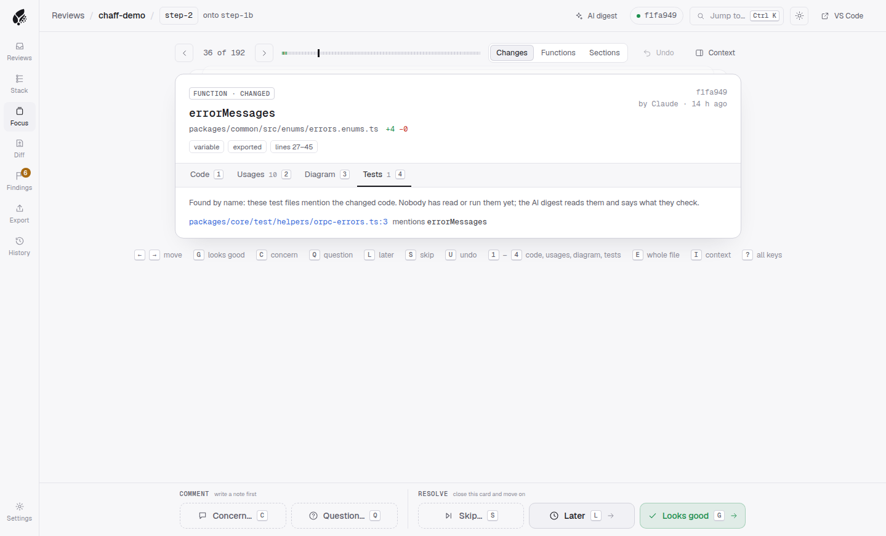
</picture>

**AI digest** in the top bar starts one and tells you which company gets the code before anything runs. You pick the model the agent runs with from its own list (Codex's model catalog, or Claude Code's model aliases; remembered per agent) and can add instructions of your own to the prompt. Only a small diff goes into the prompt whole: every file's diff is saved next to the checkout, and on a long branch the agent reads the ones it needs.

<picture>
  <source media="(prefers-color-scheme: dark)" srcset="docs/screenshots/digest-dialog-dark.png" />
  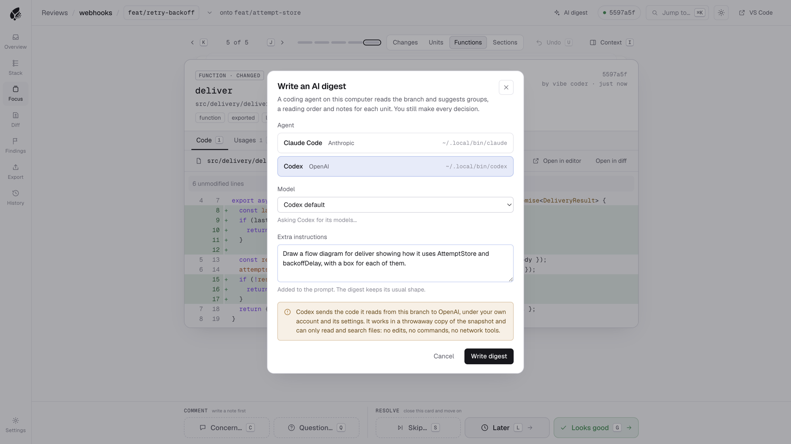
</picture>

### Full diff

One branch against its parent, with a resizable file tree (or flat list) and a filter that matches file names and the changed lines themselves. Switch between one file at a time and all files in one scroll, unified or split, with word-level highlights, syntax colors and expandable context.

<picture>
  <source media="(prefers-color-scheme: dark)" srcset="docs/screenshots/full-diff-dark.png" />
  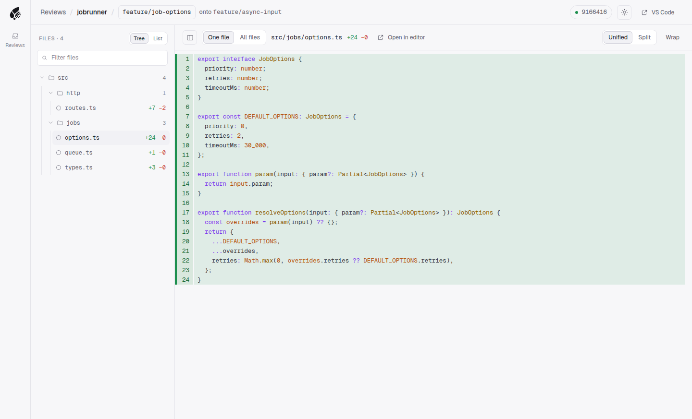
</picture>

<picture>
  <source media="(prefers-color-scheme: dark)" srcset="docs/screenshots/all-files-dark.png" />
  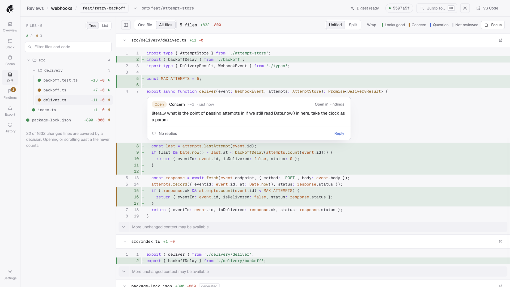
</picture>

<picture>
  <source media="(prefers-color-scheme: dark)" srcset="docs/screenshots/diff-search-dark.png" />
  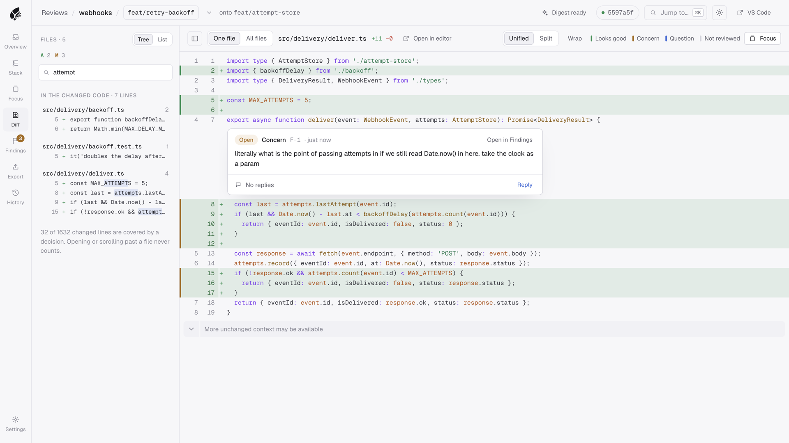
</picture>

The bar beside each changed line shows the decision on its unit, and the file list shows how far each file got. Click the **+** beside a line (or pick a range first) to write a concern, question or note on exactly those lines.

<picture>
  <source media="(prefers-color-scheme: dark)" srcset="docs/screenshots/diff-notes-dark.png" />
  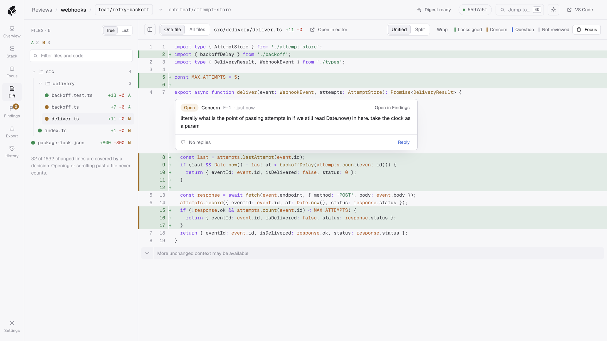
</picture>

### Findings

Everything you flagged, across every review. Each finding keeps your comment verbatim and the lines it points at as they were, so it still makes sense after the branch is rebased. Withdraw what you changed your mind about; nothing counts as resolved until you verify it.

<picture>
  <source media="(prefers-color-scheme: dark)" srcset="docs/screenshots/findings-dark.png" />
  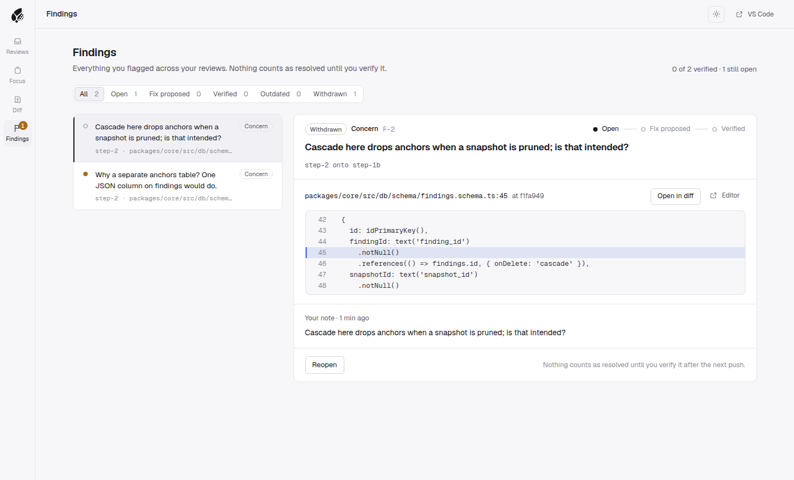
</picture>

A concern can carry a severity (Minor, Major or Blocking), picked while you write it or later on the Findings screen; exports and posted drafts include it. A concern or question written in Focus is about the card by default, and the row under the note can point it at **units you pick** from anywhere in the review (one note for the same mistake made in three places), the **whole branch**, or the **whole stack** for architectural feedback.

<picture>
  <source media="(prefers-color-scheme: dark)" srcset="docs/screenshots/focus-note-severity-dark.png" />
  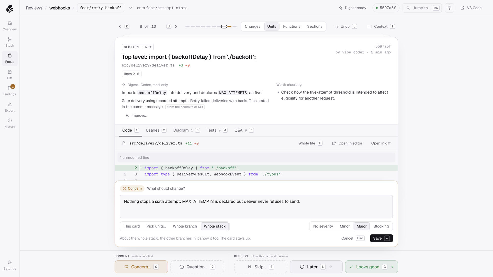
</picture>

<picture>
  <source media="(prefers-color-scheme: dark)" srcset="docs/screenshots/findings-severity-dark.png" />
  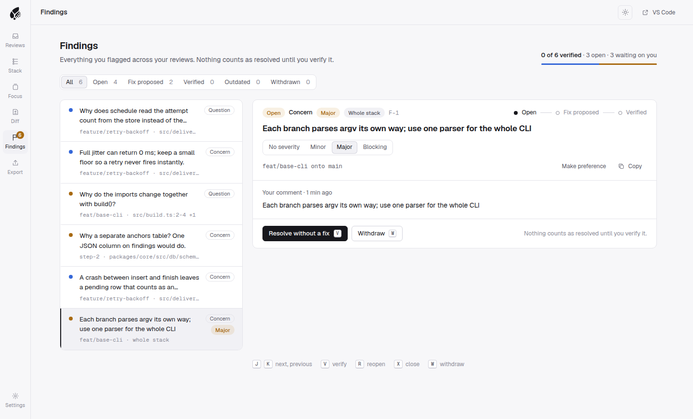
</picture>

**Suggest a task** asks your coding agent, read-only, to restate a finding as one task an agent can act on, no wider than your comment, with a line on how to verify it. You accept it as written or edited, or discard it; your comment is never rewritten, and only an accepted task goes into exports.

<picture>
  <source media="(prefers-color-scheme: dark)" srcset="docs/screenshots/finding-task-dark.png" />
  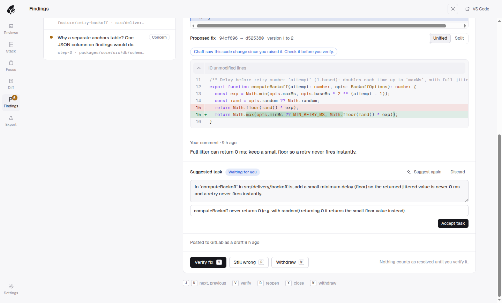
</picture>

A finding stays on the branch where you wrote it, and the branches above it hear about it: reviewing a branch shows open concerns from the branches it builds on and notes about the whole stack in a banner over the card (and under **Context**), and the Stack overview marks each affected branch.

<picture>
  <source media="(prefers-color-scheme: dark)" srcset="docs/screenshots/focus-stack-finding-dark.png" />
  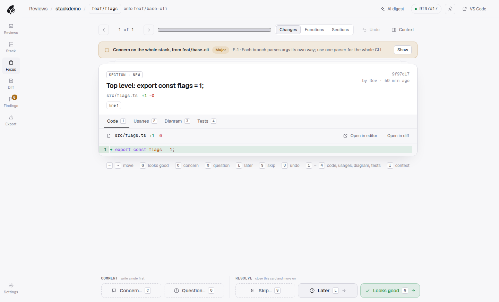
</picture>

### New changes while you review

The chip in the top bar shows the frozen commit you are reading. When the agent commits again, it turns amber and says what moved; **Update** takes a new snapshot when you are ready.

<picture>
  <source media="(prefers-color-scheme: dark)" srcset="docs/screenshots/new-commits-dark.png" />
  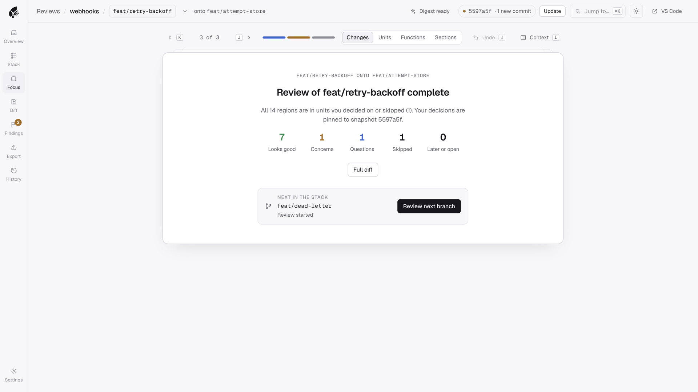
</picture>

### Second pass

After **Update**, a banner sums up the new version: units edited or added since your decisions, unchanged units that use something that changed (possibly affected), and what happened to your concerns. Decisions on unchanged units carry over. An edited card opens on **Since your decision**, the diff between the code you decided on and the code now, with **Whole change** one click away. **Recheck** walks you through the possibly affected units.

<picture>
  <source media="(prefers-color-scheme: dark)" srcset="docs/screenshots/second-pass-dark.png" />
  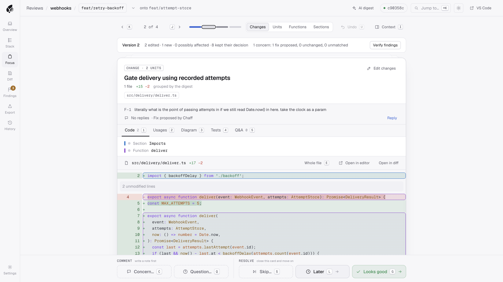
</picture>

<picture>
  <source media="(prefers-color-scheme: dark)" srcset="docs/screenshots/interdiff-dark.png" />
  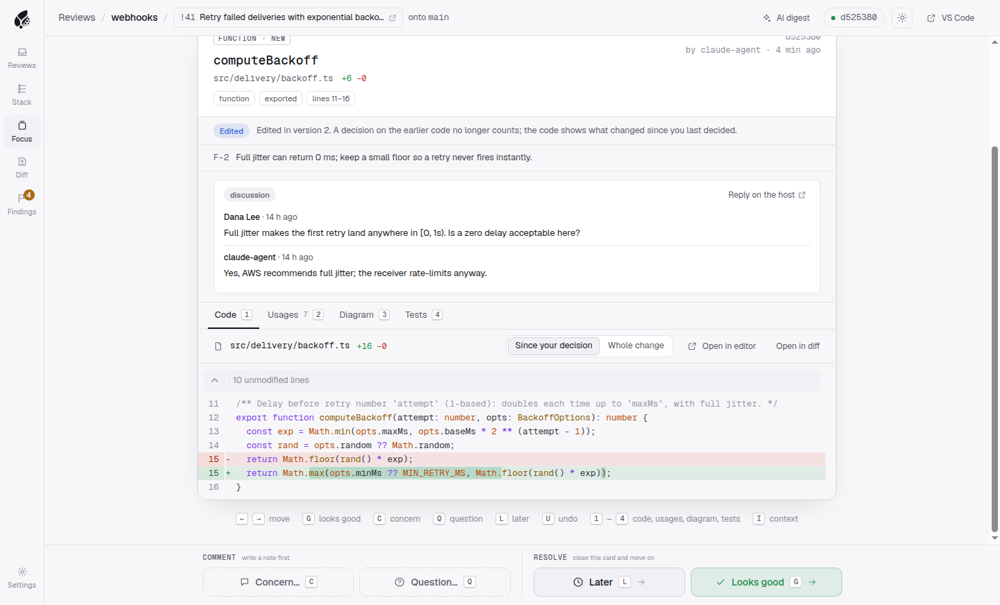
</picture>

### Verify

Every finding is looked for again in the new version: the same lines, the code between the same surrounding lines, or a block that looks like it. A concern whose code changed becomes **Fix proposed**, and the Findings screen shows the code you flagged next to what the agent changed it to. **Verify fix** (V), **Still wrong** (R) and **Withdraw** (W) settle it from the keyboard; J and K move between findings. A finding whose code can't be found any more is **Unmatched** and keeps its original quote. Questions take an answer and close.

<picture>
  <source media="(prefers-color-scheme: dark)" srcset="docs/screenshots/verify-fix-dark.png" />
  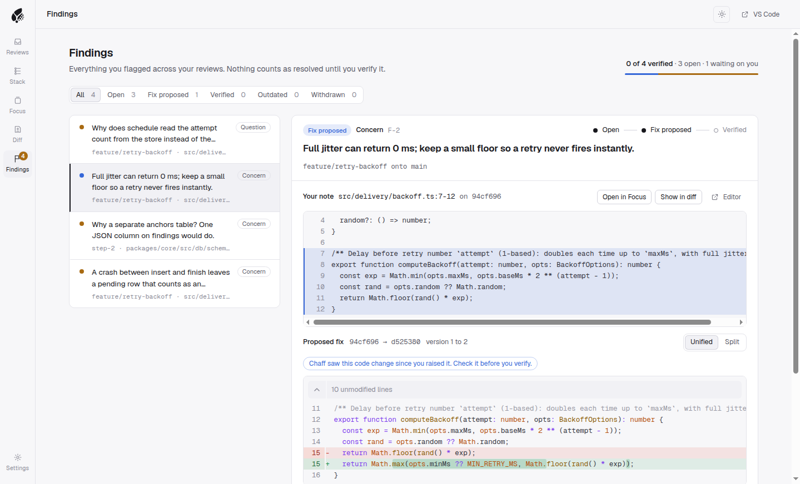
</picture>

### Merge requests and pull requests

Connect GitLab (gitlab.com or self-managed) or GitHub in **Settings** with a token, which is checked once and kept in your system keychain. Each repository's project is detected from its remotes, or picked by hand.

<picture>
  <source media="(prefers-color-scheme: dark)" srcset="docs/screenshots/settings-dark.png" />
  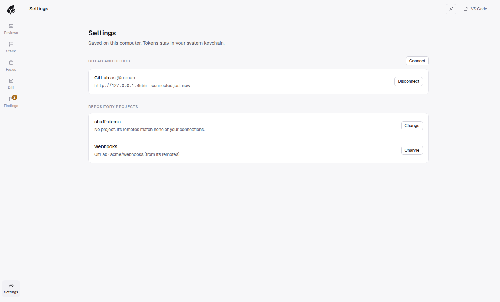
</picture>

Open merge requests appear on the Reviews screen, stacked when one targets another's branch. **Start** copies the merge request into Chaff's store and opens it in Focus like any branch. A local branch you already reviewed can be **linked** to the merge request it was pushed as, keeping its decisions and findings.

<picture>
  <source media="(prefers-color-scheme: dark)" srcset="docs/screenshots/inbox-dark.png" />
  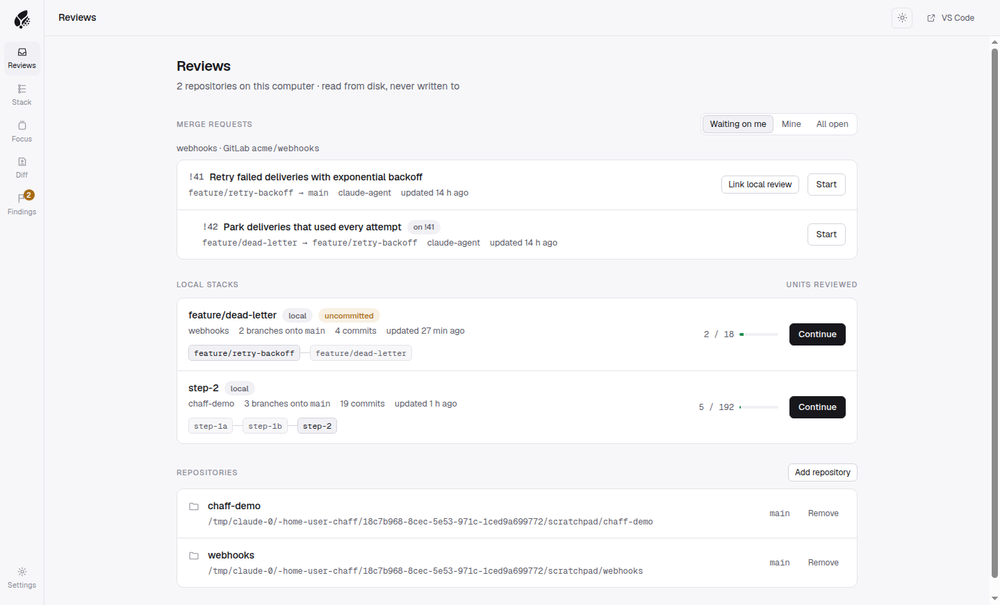
</picture>

The merge request's discussions show read-only on the unit they are about, in Focus and in the Full diff. Replies happen on the host.

<picture>
  <source media="(prefers-color-scheme: dark)" srcset="docs/screenshots/focus-mr-dark.png" />
  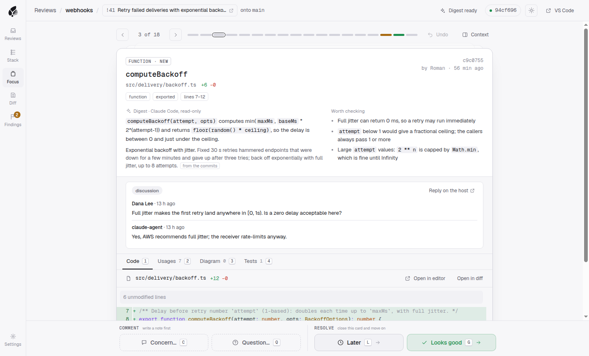
</picture>

<picture>
  <source media="(prefers-color-scheme: dark)" srcset="docs/screenshots/mr-discussion-dark.png" />
  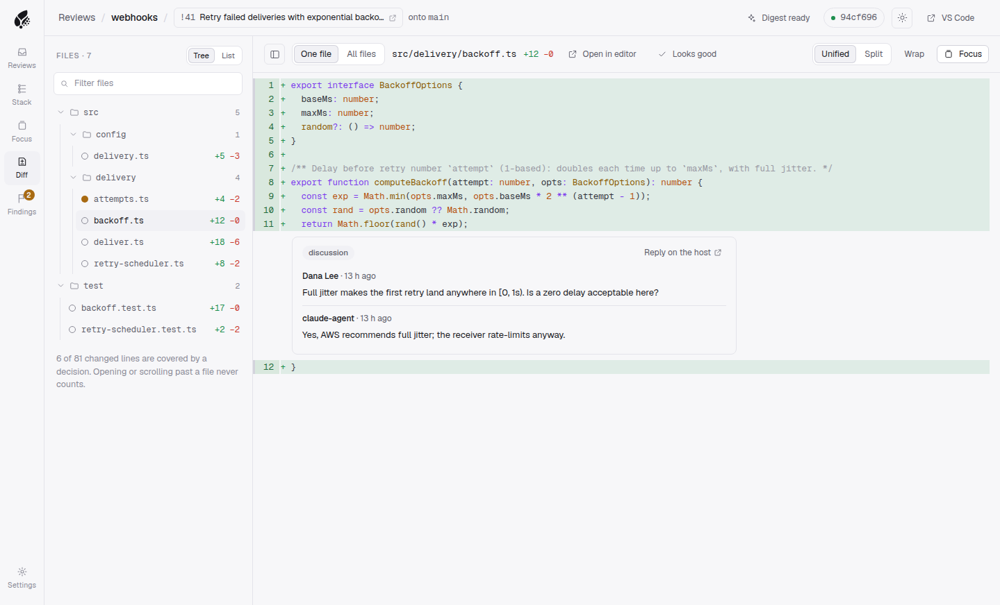
</picture>

### Export and post

**Export** turns your findings into something to act on. Pick a scope (this review, the whole stack or the repository) and which statuses to include, then copy a Markdown or JSON packet, or the **Agent prompt**: the packet plus instructions to fix each concern, answer each question and reply with a short JSON report. **Copy** on a finding copies just that one.

<picture>
  <source media="(prefers-color-scheme: dark)" srcset="docs/screenshots/export-dark.png" />
  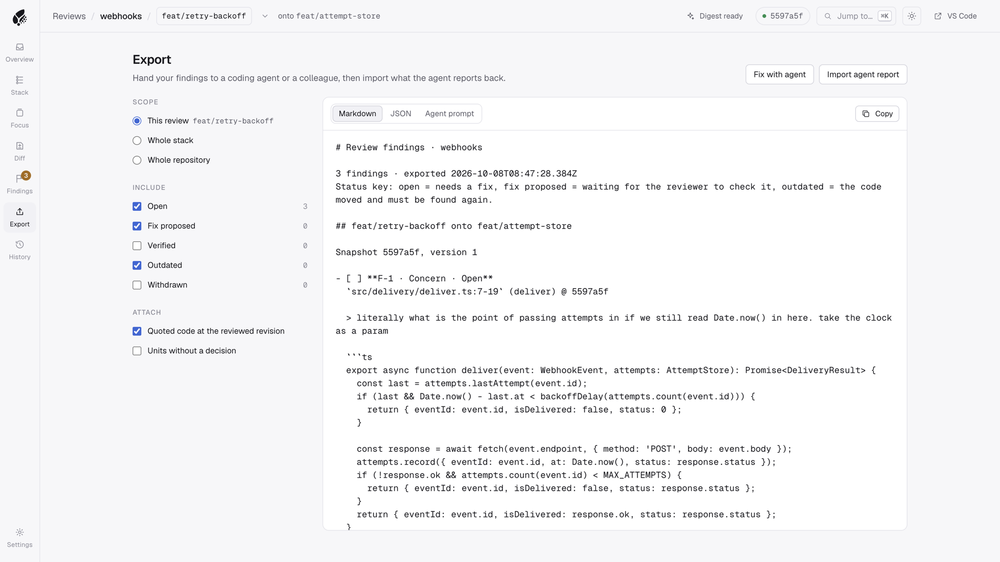
</picture>

**Import agent report** reads the agent's reply. Concerns it fixed move to **Fix proposed** and questions it answered to **Answered**, with its note and commits; nothing is verified for you, and ids that match no finding are listed.

<picture>
  <source media="(prefers-color-scheme: dark)" srcset="docs/screenshots/import-result-dark.png" />
  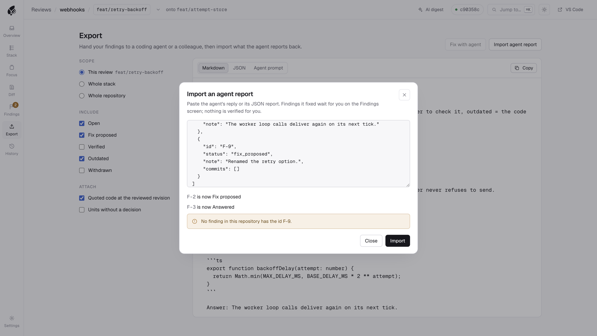
</picture>

On a merge or pull request, the drafts tab posts the findings as GitLab draft notes or one pending GitHub review, each on the first changed line it is about. Nothing is published: you submit the review on the host. The same calls are shown as `glab`/`gh` and curl commands if you would rather run them yourself.

Once the drafts are published, answers to them come back: the Findings screen shows the replies under each posted finding (**Check for replies** asks the host now), and a reply to a question can be taken as its answer with **Use as answer**. Each snapshot of a merge request also records the GitLab diff version it matches, shown as `v3` next to the commit and named in exports.

<picture>
  <source media="(prefers-color-scheme: dark)" srcset="docs/screenshots/finding-replies-dark.png" />
  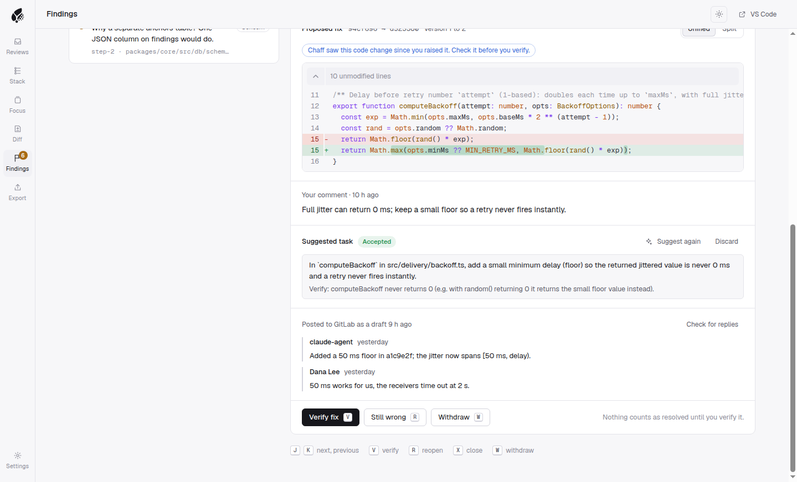
</picture>

<picture>
  <source media="(prefers-color-scheme: dark)" srcset="docs/screenshots/export-drafts-dark.png" />
  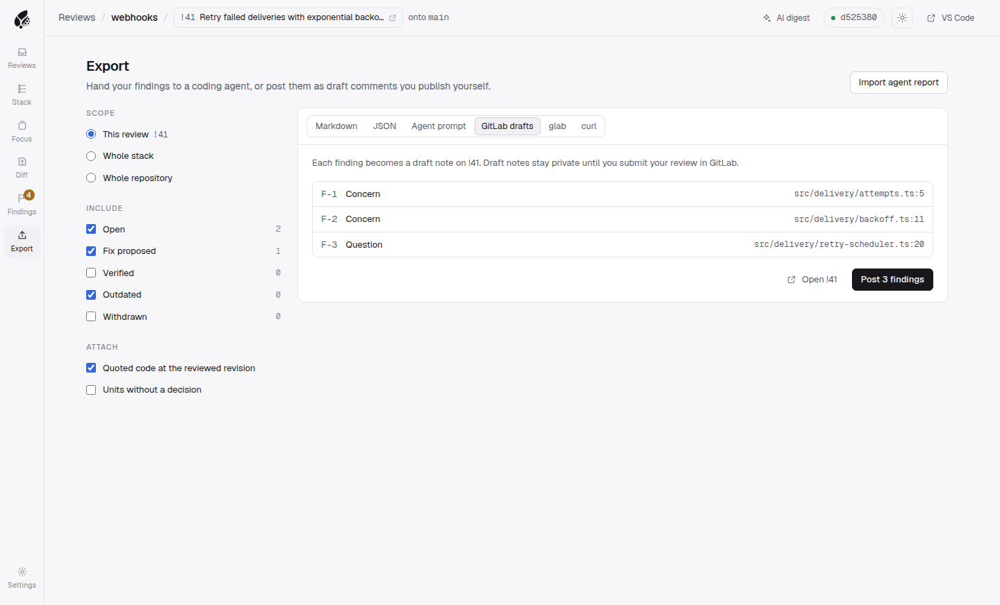
</picture>

### Fix with an agent

**Fix with agent** hands the review's open concerns and questions to Claude Code or Codex with write access, after a confirmation of its own. The agent works in a new checkout of the newest snapshot, on a new branch in Chaff's store, never in your repository. Chaff commits what it changed, reads its report (fixed concerns move to **Fix proposed**, answers are kept), and lists the run under **Agent fixes**: the changes file by file, the agent's reply, a `git fetch` command that brings the branch into your repository when you want it, and **Discard**.

<picture>
  <source media="(prefers-color-scheme: dark)" srcset="docs/screenshots/fix-dialog-dark.png" />
  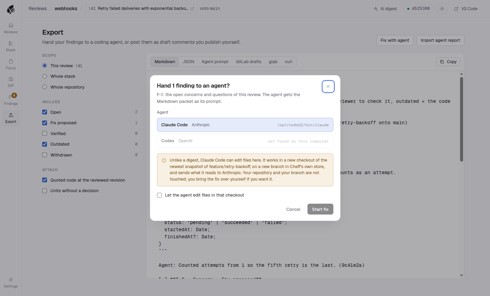
</picture>

<picture>
  <source media="(prefers-color-scheme: dark)" srcset="docs/screenshots/fix-changes-dark.png" />
  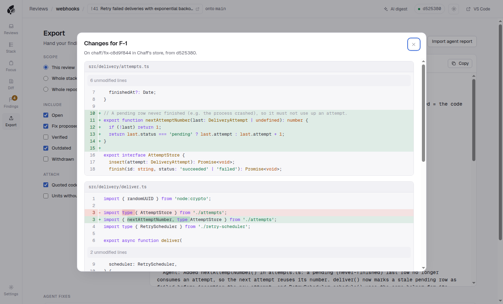
</picture>

### Project preferences

**Make preference** on a finding turns it into a rule for the repository, worded the way you want an agent to read it. Preferences live in **Settings**, where you can add, reword or delete them and copy them as a section for `CLAUDE.md` or `AGENTS.md`. Every AI digest, agent prompt and fix hand-off includes them; Chaff never adds one by itself.

<picture>
  <source media="(prefers-color-scheme: dark)" srcset="docs/screenshots/settings-preferences-dark.png" />
  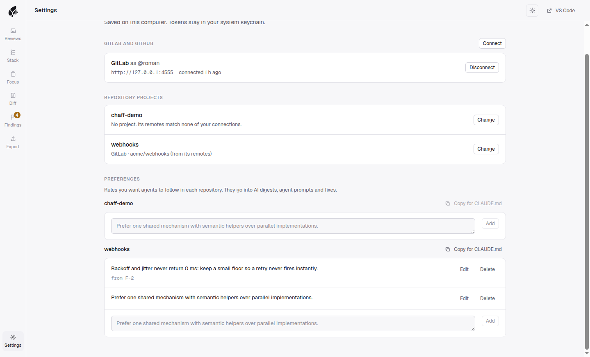
</picture>

### Agents and keys

**Settings** shows where Chaff found Claude Code and Codex, takes a command or full path for one that lives elsewhere, and picks the default for digests and fixes. A notice tells you where the code goes: to Anthropic or OpenAI, through your own account.

<picture>
  <source media="(prefers-color-scheme: dark)" srcset="docs/screenshots/settings-agents-dark.png" />
  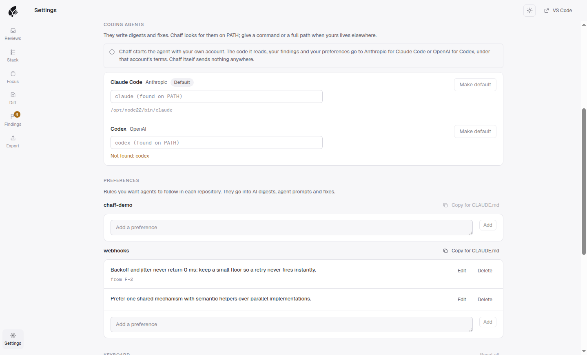
</picture>

Every Focus and Verify action can take another key: click it and press the new one. A key already used on that screen is refused with the action that has it, and **Reset** puts the default back. The hints under the card and on the buttons follow your keys.

A few keys work everywhere: **/** or **Ctrl K** (**⌘K** on a Mac) opens **Jump to**, which finds any unit or file of the open review, another review, or a screen; **?** lists every key as currently bound; **Esc** closes a dialog or the context panel. In Focus, **E** shows the whole file around the card's code, and again folds it back.

<picture>
  <source media="(prefers-color-scheme: dark)" srcset="docs/screenshots/jump-to-dark.png" />
  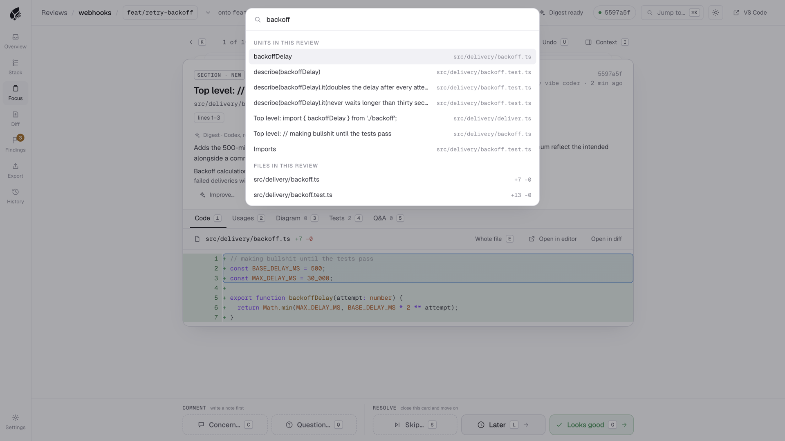
</picture>

<picture>
  <source media="(prefers-color-scheme: dark)" srcset="docs/screenshots/settings-keyboard-dark.png" />
  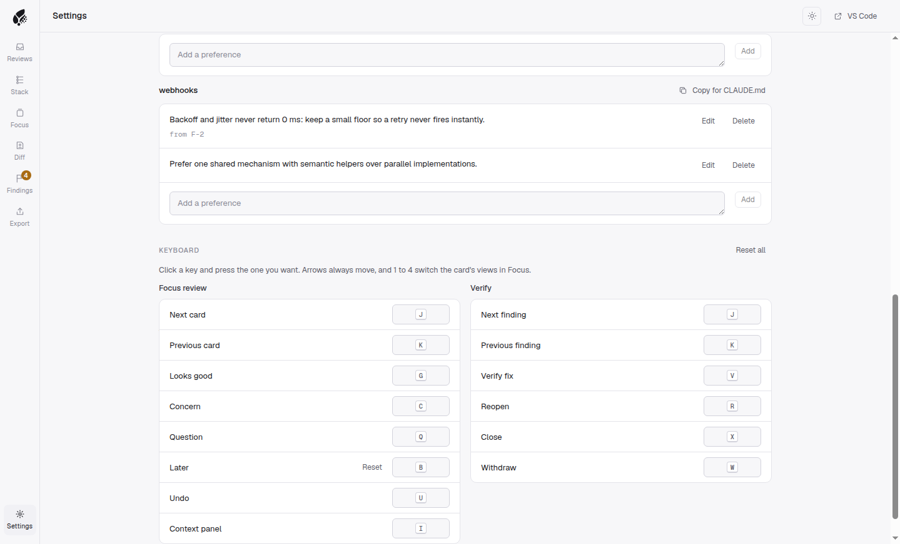
</picture>

### History

**History** in the left rail lists every review you started, newest activity first, with its version, region progress and findings. When a local branch is deleted, or its merge request is merged or closed, the review is archived rather than lost: it moves to History with its snapshots, decisions and findings, and still opens in Focus, the Full diff and Export. A branch that comes back under the same name, or a change that reopens, brings its review back.

<picture>
  <source media="(prefers-color-scheme: dark)" srcset="docs/screenshots/history-dark.png" />
  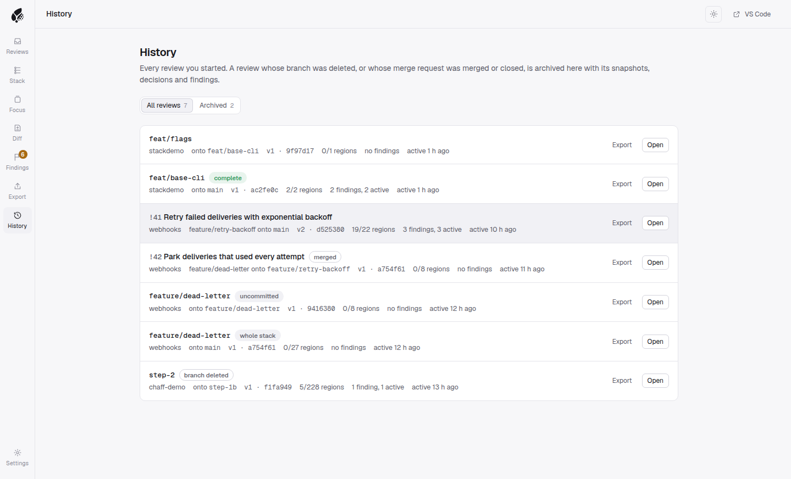
</picture>

### Open in your editor

File names and line numbers link into VS Code, VS Code Insiders or Cursor, at the path of your local checkout.

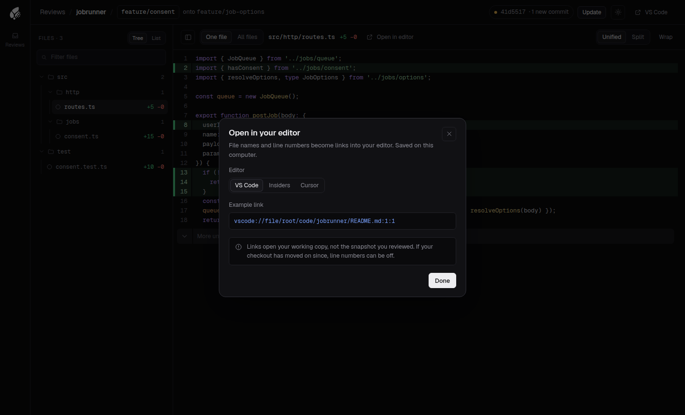

### Make it yours

**Appearance** sets the theme (system, dark, light) and accent color. It also sets the UI density (comfortable or compact) and the code font (Geist Mono, JetBrains Mono or the system's monospace), with its size and line height. Syntax colors (Chaff, GitHub, Solarized or Monochrome) are picked separately for light and dark mode. Every color comes from a theme token, so a whole theme can be swapped by changing CSS variables.

<picture>
  <source media="(prefers-color-scheme: dark)" srcset="docs/screenshots/appearance-custom-dark.png" />
  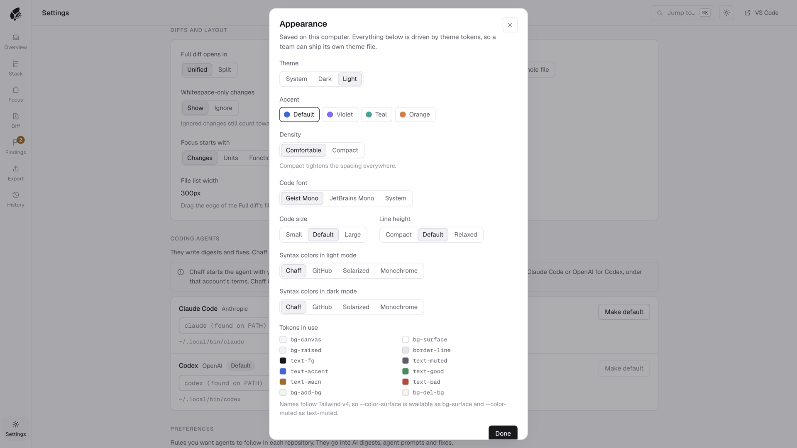
</picture>

**Settings → Diffs and layout** sets:

- which layout the Full diff opens in;
- how many unchanged lines show around each change (3, 5, 10 or the whole file);
- whether whitespace-only changes are hidden;
- whether changes inside a line are marked by word, by character or not at all;
- which progression Focus starts with;
- whether the Focus context panel opens with every review.

The width you drag the Full diff's file list to is kept.

<picture>
  <source media="(prefers-color-scheme: dark)" srcset="docs/screenshots/settings-diffs-layout-dark.png" />
  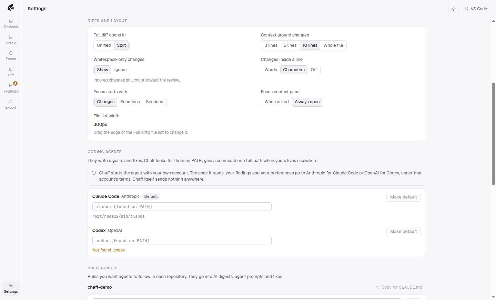
</picture>

## What works today

Everything below works in the current build.

<details>
<summary>The full list</summary>

| Area | Status |
| --- | --- |
| Electron desktop app, unsigned installers for Windows, macOS and Linux | Works |
| Add repositories from disk, read-only | Works |
| Getting started checklist: real actions in any order, Show me tips, screen hints, skip any time, replay from Settings | Works |
| Local branch stacks with suggested parents, kept together when a lower branch gets new commits | Works |
| Remote-tracking branches (all remotes, origin first) join their local stacks, can be reviewed and are noticed after git fetch | Works |
| Frozen snapshots in Chaff's own git store | Works |
| Regions, Function and Section units (tree-sitter, 14 languages including Kotlin) | Works |
| Full diff: tree or list, one or all files, unified (old and new line numbers) or split, wrap, context; filter by file name or changed code | Works |
| Diffs highlighted in background workers, files far off screen skip layout, React Compiler on every component | Works |
| Added, modified, deleted, renamed and type-changed files marked git-style: A/M/D/R/T in the file list with counts, badges and the previous path on file headers and Focus cards | Works |
| New commits, rewritten branches and moved parents detected as they happen (refs are watched); Update | Works |
| Open in VS Code, Insiders or Cursor | Works |
| Light and dark themes, accent, code size | Works |
| Code font, line height, UI density, syntax colors per mode | Works |
| Diff defaults (layout, context lines, whitespace, changes inside a line), file list width, pinned context panel, default progression | Works |
| Focus review: one unit at a time, keyboard decisions, undo, Later queue | Works |
| Decisions on every unit, shown in Full diff with line coverage | Works |
| Findings (Concern, Question, Note) on units or line ranges, Findings screen | Works |
| AI digest via your local Claude Code or Codex, read-only: notes, intent, tests, diagrams, reading order | Works |
| Digest reads the MR or PR description and linked issues, outlines branches too large to send whole, streams in while Claude Code writes, and its diagram boxes open their units | Works |
| Digest model picked from the agent's own model list (remembered per agent) and extra instructions for one digest | Works |
| Digest agent reads per-file diffs on demand instead of one huge prompt on long branches | Works |
| Stack overview with parent editing and cumulative view | Works |
| GitLab merge requests and stacked MRs: inbox, snapshots, new versions, discussions | Works |
| GitHub pull requests, the same way | Works |
| Linking a local branch's review to the merge request it became | Works |
| History of every review; reviews of deleted branches and merged or closed changes archived with their findings | Works |
| Findings posted as GitLab draft notes or a pending GitHub review | Works |
| Replies to posted findings pulled back, a reply taken as a question's answer | Works |
| GitLab diff version stored with each merge request snapshot | Works |
| Working changes (uncommitted work) as a review target | Works |
| Second pass: interdiffs, re-anchored findings, Verify screen | Works |
| Export: Markdown and JSON packets, agent prompt, copy one finding, agent report import | Works |
| Fix hand-off: a local agent fixes findings in its own checkout, on a branch of Chaff's store | Works |
| Project preferences: promoted from findings, exported for CLAUDE.md, given to digests and agents | Works |
| Swipe decisions in Focus with a finger or pen | Works |
| Change units: digest groups as Focus cards; make, split, merge, rename, reorder; Changes, Functions or Sections progression | Works |
| Skip with a reason; a review is complete once every region is decided on or skipped | Works |
| Finding severity; findings on several units, a whole branch or a whole stack; concerns shown on the branches above | Works |
| Suggested task for a finding from your coding agent: accept, edit or discard; exported once accepted | Works |
| Rebindable keys for Focus and Verify | Works |
| Jump to (/ or Ctrl K), key list (?), Esc closes panels, E shows the whole file in Focus | Works |
| Start a review from a pasted MR or PR link, `!412` / `#412`, or a branch name; switch reviews from the top bar | Works |
| Open-finding counts on Reviews rows; per-unit progress and +/- before review on the Stack screen | Works |
| Syntax colors in finding quotes and Usages | Works |
| Agent settings: custom command paths, default agent, privacy notice | Works |

</details>

## Stack

- **Desktop:** Electron 44 with a sandboxed renderer, a strict CSP and typed oRPC calls over a `MessagePort`. Packaged with electron-builder.
- **Core (`@chaff/core`):** a plain TypeScript library bundled into the Electron main process, with no Electron imports so a web mode stays possible later. Drizzle ORM on Node's built-in `node:sqlite`, tsyringe, Zod, and tree-sitter compiled to WASM (`@vscode/tree-sitter-wasm`, no native modules). Git access goes through the `git` on your PATH.
- **Renderer (`apps/web`):** React 19 single-page app with Vite, TanStack Router and Query, Base UI, Tailwind CSS theme tokens, and [`@pierre/diffs`](https://www.npmjs.com/package/@pierre/diffs) for diff rendering.
- **Shared:** `@chaff/server-contract` (API contracts), `@chaff/common` (shared helpers and enums), `enumwaii` and `eslint-plugin-enumwaii` from npm (typed closed string sets and their ESLint rules).

## Install

You need Git 2.40 or newer on your PATH, Node.js 24 and pnpm 11.5.0 (`corepack enable` picks it up from `package.json`).

There are no downloads. Builds are unsigned (I will not be paying for a license for a side project), so you build Chaff from source. It takes a few minutes.

### macOS

```bash
git clone https://github.com/CatOfJupit3r/chaff.git
cd chaff
pnpm install
pnpm run install-app
```

`install-app` builds Chaff from your checkout and installs it as `/Applications/Chaff.app`, quitting a running Chaff first and opening it again afterwards. Closing the window keeps Chaff running; click the Dock icon to bring it back, and quit with Cmd+Q.

### Windows and Linux

```bash
git clone https://github.com/CatOfJupit3r/chaff.git
cd chaff
pnpm install
pnpm run package
```

This writes an NSIS installer (Windows) or an AppImage (Linux) to `apps/desktop/release`. On Windows, SmartScreen will warn about the unsigned build: choose **More info**, then **Run anyway**. On Linux, make the AppImage executable (`chmod +x`) and run it.

### Updating

There is no updater. There is `git pull`.

On macOS, `install-app` also sets up a git hook: after each `git pull` (merge or rebase) on `main`, it rebuilds Chaff in the background, swaps it into `/Applications`, reopens it if it was running and shows a notification when the new build is in. The build log is in `~/Library/Logs/Chaff/install-app.log`. To turn it off for your checkout:

```bash
git config chaff.autoInstall false
```

On Windows and Linux, pull and package again, then run the new installer:

```bash
git pull
pnpm install
pnpm run package
```

Your reviews survive updates; they live in the app data folder, not in the app.

### Installing the DMG by hand

`pnpm run package` on macOS writes a DMG instead of installing anything.

1. Open `apps/desktop/release/Chaff-<version>-<arch>.dmg` and drag **Chaff** into **Applications**.
2. The first time, right-click Chaff in Applications and choose **Open**. If macOS still refuses to open it, clear the quarantine flag:

   ```bash
   xattr -dr com.apple.quarantine /Applications/Chaff.app
   ```

3. While it runs, right-click its Dock icon and choose **Options > Keep in Dock**. Spotlight and Launchpad find it too.

### Running from source

```bash
pnpm run dev
```

opens Chaff in an Electron window with live reload. Click **Add repository** and pick any folder inside a git repository, then start a stack from one of its branches.

### Where your data lives

Chaff keeps its database and snapshot store in the OS app data folder: `%APPDATA%\Chaff` on Windows, `~/Library/Application Support/Chaff` on macOS, `~/.config/Chaff` on Linux. `pnpm run dev` uses a separate `Chaff Dev` folder next to it.

## Contributing

[docs/development.md](docs/development.md) covers the repository layout, workspace commands, commit hooks and conventions. Agents (Claude Code and other `AGENTS.md`-aware tools) start from [AGENTS.md](AGENTS.md) and the skills in `.agents/skills/`.
