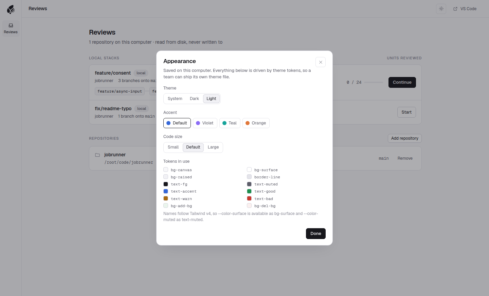

<p align="center">
  
</p>

<h1 align="center">Chaff</h1>

<p align="center">
  A stack-aware review workspace for AI-written changes.<br />
  Understand what changed. Inspect how it was implemented. Capture what bothers you. Verify what gets fixed.
</p>

<picture>
  <source media="(prefers-color-scheme: dark)" srcset="docs/screenshots/full-diff-split-dark.png" />
  
</picture>

Chaff is a desktop app for reviewing the code that agents like Claude Code and Codex write, usually as a stack of branches or merge requests that build on each other (`main <- A <- B <- C`). It reads those branches straight from the repository on your computer, freezes what you are reviewing so a new push can't move code under you, and shows each branch's own contribution against its parent.

> **Status:** early. Local branch stacks with the Stack overview, working changes, GitLab merge requests and GitHub pull requests, frozen snapshots, Focus review with the AI digest, the Full diff and findings work today. The second pass and export are being built next. See [What works today](#what-works-today).

## Why Chaff

Agents produce a lot of code, and reviewing it is where the time goes. Three things make it harder than reviewing a colleague's work:

- **Stacks are long.** A feature often arrives as ten small branches. Forge UIs show each one in isolation, so you lose track of which branch introduced what.
- **Objections get lost.** You notice something odd in branch 3, and by branch 7 you have forgotten it, or you can't tell whether the agent's next push fixed it.
- **The code keeps moving.** The agent pushes while you read. Diffs regenerate, your place is gone, and you start over.

Chaff keeps the reviewer in charge: it never decides what you see or what is resolved. Its job is to let you read at the level that's useful (a whole change, one function, or specific lines), capture a concern in a keystroke, remember what you inspected at which revision, and bring you back only to what needs another look after the agent pushes fixes.

## How it works

1. **Add a repository.** Pick a folder on disk. Chaff reads it with your own `git` and never writes to it: no checkouts, no new refs, no stash.
2. **Chaff finds the stacks.** Each local branch gets a suggested parent (the other branch it has the fewest commits on top of), so `feature/async-input <- feature/job-options <- feature/consent` shows up as one stack.
3. **Start a review and Chaff freezes a snapshot.** The branch, its parent and their merge base are fetched into Chaff's own bare repository and pinned, so rebasing, amending or deleting the branch does not break the review.
4. **Chaff breaks the change into regions and units.** Every changed range is a region with a stable id. Tree-sitter maps regions to the functions, methods and classes that own them (Function units); everything else (imports, config, deleted or generated files) becomes a Section unit, so nothing is dropped.
5. **You read the diff in reading order.** Types and contracts come first, tests sit next to the code they test, and config, docs and generated files come last.
6. **When the branch moves, Chaff tells you.** New commits, a rewritten branch or a moved parent show up next to the snapshot, and **Update** freezes a new snapshot when you choose to.

[docs/how-it-works.md](docs/how-it-works.md) goes deeper: the architecture, the snapshot store, regions and units, and where Chaff keeps its data.

## Tour

### Reviews

Every repository you add, with its local branch stacks. Click a branch in the chain to review it against its parent, or **Continue** where you left off.

<picture>
  <source media="(prefers-color-scheme: dark)" srcset="docs/screenshots/reviews-dark.png" />
  
</picture>

### Stack overview

The whole stack top to bottom, each branch with its decisions so far, and the selected branch beside it: its parent (confirm Chaff's suggestion or pick another), what moved since your snapshot, its units, and the branches that build on it. **Cumulative from main** reviews everything from the stack's base to this branch in one pass.

<picture>
  <source media="(prefers-color-scheme: dark)" srcset="docs/screenshots/stack-overview-dark.png" />
  
</picture>

### Working changes

A branch checked out with uncommitted work gets an **uncommitted** tag. **Review working changes** copies the files into Chaff's own store as a snapshot on top of the branch, so you can read what the agent has not committed yet. Your files, index and stash stay as they were.

<picture>
  <source media="(prefers-color-scheme: dark)" srcset="docs/screenshots/stack-working-changes-dark.png" />
  
</picture>

<picture>
  <source media="(prefers-color-scheme: dark)" srcset="docs/screenshots/focus-working-changes-dark.png" />
  
</picture>

### Focus review

One unit at a time: a function, a type or a section of a file, shown whole with its changes marked, the commit that last touched it, and the places that use it. Resolve the card with **Looks good** (G) or **Later** (L), or write a **Concern** (C) or **Question** (Q) and keep reading. Notes become findings pinned to the code. **U** undoes, **I** opens the list of every unit, and the last card tallies what you decided and walks you through the ones you put off.

<picture>
  <source media="(prefers-color-scheme: dark)" srcset="docs/screenshots/focus-dark.png" />
  
</picture>

<picture>
  <source media="(prefers-color-scheme: dark)" srcset="docs/screenshots/focus-note-dark.png" />
  
</picture>

### AI digest

Chaff can ask the coding agent already on your computer (Claude Code or Codex) to read the branch first. The agent works in a throwaway, read-only copy of the snapshot, with read and search tools only, and Chaff checks its answer before keeping it. The digest then rides along in Focus: a summary and a short "Worth checking" list on each card, why the change was made (marked as taken from the commits or inferred), the tests that cover the unit, and a diagram where one helps. The Context panel (I) lists the changes the branch is made of, and the cards follow the digest's reading order. Nothing in the digest decides anything for you: every unit still waits for your call, and units the digest could not explain land in a visible "Other changes" group.

<picture>
  <source media="(prefers-color-scheme: dark)" srcset="docs/screenshots/focus-digest-dark.png" />
  
</picture>

<picture>
  <source media="(prefers-color-scheme: dark)" srcset="docs/screenshots/digest-context-dark.png" />
  
</picture>

<picture>
  <source media="(prefers-color-scheme: dark)" srcset="docs/screenshots/focus-diagram-dark.png" />
  
</picture>

The Tests tab keeps three facts apart: a test exists, the agent read it, and it passed. Chaff never runs tests, so a digest can't claim the third.

<picture>
  <source media="(prefers-color-scheme: dark)" srcset="docs/screenshots/focus-tests-dark.png" />
  
</picture>

**AI digest** in the top bar starts one and says which company receives the code before anything runs.

<picture>
  <source media="(prefers-color-scheme: dark)" srcset="docs/screenshots/digest-dialog-dark.png" />
  
</picture>

### Full diff

One branch against its parent, with a resizable file tree (or flat list) and a filter. Switch between one file at a time and all files in one scroll, unified or split, with word-level highlights, syntax colors and expandable context.

<picture>
  <source media="(prefers-color-scheme: dark)" srcset="docs/screenshots/full-diff-dark.png" />
  
</picture>

<picture>
  <source media="(prefers-color-scheme: dark)" srcset="docs/screenshots/all-files-dark.png" />
  
</picture>

The bar beside each changed line shows the decision on its unit, and the file list shows how far each file got. Click the **+** beside a line (or pick a range first) to write a concern, question or note on exactly those lines.

<picture>
  <source media="(prefers-color-scheme: dark)" srcset="docs/screenshots/diff-notes-dark.png" />
  
</picture>

### Findings

Everything you flagged, across every review. Each finding keeps your comment verbatim and the lines it points at as they were, so it still makes sense after the branch is rebased. Withdraw what you changed your mind about; nothing counts as resolved until you verify it.

<picture>
  <source media="(prefers-color-scheme: dark)" srcset="docs/screenshots/findings-dark.png" />
  
</picture>

### New changes while you review

The chip in the top bar shows the frozen commit you are reading. When the agent commits again, it turns amber and says what moved; **Update** takes a new snapshot when you are ready.

<picture>
  <source media="(prefers-color-scheme: dark)" srcset="docs/screenshots/new-commits-dark.png" />
  
</picture>

### Merge requests and pull requests

Connect GitLab (gitlab.com or self-managed) or GitHub in **Settings** with a read-only token, which is checked once and kept in your system keychain. Each repository's project is detected from its remotes, or picked by hand.

<picture>
  <source media="(prefers-color-scheme: dark)" srcset="docs/screenshots/settings-dark.png" />
  
</picture>

Open merge requests appear on the Reviews screen, stacked when one targets another's branch. **Start** copies the merge request into Chaff's store and opens it in Focus like any branch. A local branch you already reviewed can be **linked** to the merge request it was pushed as, keeping its decisions and findings.

<picture>
  <source media="(prefers-color-scheme: dark)" srcset="docs/screenshots/inbox-dark.png" />
  
</picture>

The merge request's discussions show read-only on the unit they are about, in Focus and in the Full diff. Replies happen on the host.

<picture>
  <source media="(prefers-color-scheme: dark)" srcset="docs/screenshots/focus-mr-dark.png" />
  
</picture>

<picture>
  <source media="(prefers-color-scheme: dark)" srcset="docs/screenshots/mr-discussion-dark.png" />
  
</picture>

### Open in your editor

File names and line numbers link into VS Code, VS Code Insiders or Cursor, at the path of your local checkout.


### Light and dark, your accent

Theme (system, dark, light), accent color and code size. Every color comes from a theme token, so a whole theme can be swapped by changing CSS variables.

<picture>
  <source media="(prefers-color-scheme: dark)" srcset="docs/screenshots/appearance-dark.png" />
  
</picture>

## What works today

| Area | Status |
| --- | --- |
| Electron desktop app, unsigned installers for Windows, macOS and Linux | Works |
| Add repositories from disk, read-only | Works |
| Local branch stacks with suggested parents | Works |
| Frozen snapshots in Chaff's own git store | Works |
| Regions, Function and Section units (tree-sitter, 13 languages) | Works |
| Full diff: tree or list, one or all files, unified or split, wrap, context | Works |
| New commits, rewritten branches and moved parents detected; Update | Works |
| Open in VS Code, Insiders or Cursor | Works |
| Light and dark themes, accent, code size | Works |
| Focus review: one unit at a time, keyboard decisions, undo, Later queue | Works |
| Decisions on every unit, shown in Full diff with line coverage | Works |
| Findings (Concern, Question, Note) on units or line ranges, Findings screen | Works |
| AI digest via your local Claude Code or Codex, read-only: notes, intent, tests, diagrams, reading order | Works |
| Stack overview with parent editing and cumulative view | Works |
| GitLab merge requests and stacked MRs: inbox, snapshots, new versions, discussions | Works |
| GitHub pull requests, the same way | Works |
| Linking a local branch's review to the merge request it became | Works |
| Findings posted as GitLab draft notes or a pending GitHub review | Planned |
| Working changes (uncommitted work) as a review target | Works |
| Second pass: interdiffs, re-anchored findings, Verify screen | Planned |
| Export: Markdown and JSON packets, GitLab draft notes, agent report import | Planned |

## Stack

- **Desktop:** Electron 44 with a sandboxed renderer, a strict CSP and typed oRPC calls over a `MessagePort`. Packaged with electron-builder.
- **Core (`@chaff/core`):** a plain TypeScript library bundled into the Electron main process, with no Electron imports so a web mode stays possible later. Drizzle ORM on Node's built-in `node:sqlite`, tsyringe, Zod, and tree-sitter compiled to WASM (`@vscode/tree-sitter-wasm`, no native modules). Git access goes through the `git` on your PATH.
- **Renderer (`apps/web`):** React 19 single-page app with Vite, TanStack Router and Query, Base UI, Tailwind CSS theme tokens, and [`@pierre/diffs`](https://www.npmjs.com/package/@pierre/diffs) for diff rendering.
- **Shared:** `@chaff/server-contract` (API contracts), `@chaff/common` (shared helpers and enums), `@chaff/enumwaii` (typed closed string sets and their ESLint rules).

## Getting started

You need Git 2.40 or newer on your PATH, Node.js 24 and pnpm 11.5.0 (`corepack enable` picks it up from `package.json`).

```bash
git clone https://github.com/CatOfJupit3r/chaff.git
cd chaff
pnpm install
pnpm run dev
```

`pnpm run dev` opens Chaff in an Electron window with live reload. Click **Add repository** and pick any folder inside a git repository; its local branch stacks appear on the Reviews screen.

To build an installer for your OS:

```bash
pnpm run package
```

This writes a DMG (macOS), an NSIS installer (Windows) or an AppImage (Linux) to `apps/desktop/release`. Builds are unsigned and do not auto-update:

- **macOS:** right-click Chaff in Applications and choose **Open** the first time.
- **Windows:** in the SmartScreen prompt choose **More info**, then **Run anyway**.

Chaff keeps its database and snapshot store in the OS app data folder: `%APPDATA%\Chaff` on Windows, `~/Library/Application Support/Chaff` on macOS, `~/.config/Chaff` on Linux. `pnpm run dev` uses a separate `Chaff Dev` folder next to it.

## Contributing

[docs/development.md](docs/development.md) covers the repository layout, workspace commands, commit hooks and conventions. Agents (Claude Code and other `AGENTS.md`-aware tools) start from [AGENTS.md](AGENTS.md) and the skills in `.agents/skills/`.
