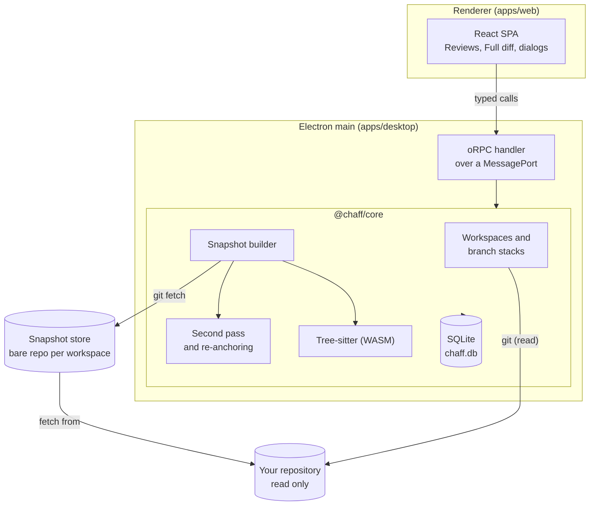

# How Chaff works

This page describes what runs today. Parts of the design that are not built yet are marked **planned**; the [README](../README.md#what-works-today) has the full list.

## The pieces

- **Renderer.** A React single-page app. It never touches Node, the file system or git; everything goes through typed calls to the core. It runs sandboxed with context isolation and a strict Content Security Policy, and is served from Chaff's own `chaff://app/` scheme.
- **Bridge.** The preload script hands the renderer one end of a `MessageChannel`. The main process checks that the sender is Chaff's own page, then serves the core's oRPC router over that port. Calls and their errors are typed by the contracts in `packages/server-contract`.
- **Core.** `@chaff/core` is a plain TypeScript library with no Electron imports, bundled into the main process. Anything that needs the OS (picking a folder, opening a link, applying the native theme) goes through a small host interface the desktop app provides, which keeps a later self-hosted web mode possible without a rewrite.
- **SQLite.** One database file in the app data folder holds workspaces, review targets, snapshots, regions, units and settings. It uses Node's built-in `node:sqlite` through Drizzle ORM, so there are no native modules to rebuild for Electron.

## Repositories are read, never written

Adding a repository stores its path and default branch. From then on Chaff runs your installed `git` against it with read-only commands such as `for-each-ref`, `rev-list`, `rev-parse` and `merge-base`, and the snapshot store fetches from it. It does not check out branches, add refs, touch the index or the stash, or write anywhere inside the repository.

## Finding stacks

Chaff lists your local branches and suggests a parent for each one:

- It walks the branch's history, merged-in commits included, and collects the tips of other local branches it finds.
- It picks the one with the fewest commits between that tip and the branch, so a branch that merged newer commits from its parent (or from the default branch) still stacks on its parent.
- Ties go to the branch's upstream, then the default branch, then alphabetical order. At the branch's own tip, only the default branch or an alphabetically earlier branch can be the parent, so two branches on the same commit don't claim each other.
- A branch with no other branch in its history stacks on the default branch.

Branches that chain this way form a stack, shown on the Reviews screen as `feature/async-input <- feature/job-options <- feature/consent`. Each branch is reviewed against its parent, so you read only what that branch adds. On the Stack overview you can confirm a suggested parent or pick another one; a confirmed parent is stored with the review target and wins over the suggestion from then on. Chaff refuses a parent that already builds on the branch, so a stack can't loop. When a parent moves under a branch you are reviewing, the snapshot chip says so and **Update** compares against the new parent.

A **cumulative** review reads a branch against the stack's base instead of its parent, so the whole stack up to that branch is one review. It is its own review target, so its marks and findings never mix with the branch's own review.

A finding lives on the branch it was written on. A finding has a scope: code (it has anchors), the whole branch (none) or the whole stack (none, by choice). A review shows the active concerns on the branches below it (following the stored parents through the reviewed branches) and active whole-stack findings from any other branch of its stack, without copying them.

## Working changes

`git worktree list` tells Chaff which branches are checked out and where. For a checked-out branch with uncommitted changes, **Review working changes** builds a commit in the snapshot store without touching your repository:

1. A temporary index file in Chaff's data folder is filled from the branch's head (`read-tree`).
2. `git add --all` runs with `GIT_INDEX_FILE` pointing at that temporary index and `GIT_DIR` pointing at the store, so the blobs land in the store and your index, stash and files are untouched.
3. `write-tree` and `commit-tree` record that tree as a commit on top of the branch head, authored by Chaff, and the snapshot diffs it against the branch head.

The working tree is fingerprinted (paths, sizes and modification times of changed files), so the snapshot chip reports new working changes while you review. Untracked files are included and `.gitignore` is honored; the repository's `info/exclude` is not, because Chaff reads it through the store.

## Snapshots

Starting a review freezes a **snapshot** of one branch against its parent:

1. Chaff fetches the branch and its parent from your repository into its own **snapshot store**, a bare git repository per workspace at `<app data>/stores/<workspace id>.git`.
2. It records three commits: the branch head, the parent head and their merge base. The diff is always merge base to branch head.
3. It pins those commits under `refs/chaff/snapshots/<snapshot id>/{head,parent,base}` in the store, so rebasing, force-updating or deleting the branch in your repository never breaks a review, and git's garbage collection can't remove them.

While you review, Chaff compares the snapshot with your repository and reports what moved: new commits on the branch, a rewritten branch (its old head is no longer in its history), a parent that moved, or a deleted branch. Nothing under the review changes until you press **Update**, which freezes a new snapshot of the same target. The [second pass](#the-second-pass) then compares the two snapshots.

## Regions and units

Each snapshot is broken down before you read it:

- A **region** is one contiguous changed range in one file, with a content hash. Every changed line belongs to exactly one region. Changes without line content (binary files, renames, mode changes) get one file-level region, so they are counted too.
- A **unit** is something you review. Chaff parses the old and new version of each file with tree-sitter and assigns each region to the declaration that encloses it: a function, method, class or other declaration becomes a **Function** unit, shown whole. Changes outside any declaration (imports, top-level statements, config, deleted, generated or unsupported files) become **Section** units. Nothing is dropped for being small or uninteresting.
- Supported grammars: TypeScript, TSX, JavaScript, Python, Go, Rust, Java, C#, Ruby, PHP, C++, Bash and PowerShell.

Units are numbered across the snapshot in reading order, and their count shows on the Reviews screen. Focus review walks them one at a time; a decision on a unit covers every region in it, so the Full diff can show line coverage. A **Change** unit groups Function and Section units into one behavior or design change, possibly across files. The AI digest proposes them (below) and you can make, split, merge, rename, reorder or ungroup them; a unit is in one Change unit at most, and units in none get a card of their own, so every region stays reachable. Deciding on a Change unit marks each of its units, so coverage is still counted over regions. A unit can also be **skipped** with a reason; a review is complete when every region belongs to a unit that is decided on or skipped, which is the count the Reviews and Stack screens show. When a review gets a new version, Change units follow their units to it.

## Reading order

Files in the Full diff are sorted so that what other code depends on comes first:

1. Types, interfaces, contracts and schemas.
2. Source files, each followed by its tests.
3. Config, then docs, then generated files, then binaries.

Generated files, lockfiles and very large diffs stay collapsed until you ask for them.

## The second pass

**Update** compares the new snapshot with the one before it, unit by unit:

1. **Pairing.** Units are matched by file, kind and name (in order when a name repeats). Section units, which have no name, are matched by their start line within three lines. A paired unit points at its previous version, so its history can be walked back.
2. **Revisions.** A paired unit whose regions hash the same is **unchanged** and keeps its decision, marked as carried over. One with different code is **edited** and goes back to undecided, and an unpaired one is **new**. An unchanged unit whose code names an edited or removed declaration (a whole word of three characters or more) is **possibly affected**: it keeps its decision and joins the Recheck queue. This match is by name, so it can flag a unit that uses a same-named thing from elsewhere; it never hides one.
3. **Since your decision.** For an edited unit, Chaff walks back to the newest version you gave a decision and diffs that code against the code now.
4. **Re-anchoring.** Every finding's lines are looked for again in the new version of their file, starting from where they were last found: the same lines (preferring the copy whose surrounding lines agree, then the nearest), else whatever now sits between the same surrounding lines, else a block that looks like the old one (by shared tokens) next to one of them, or anywhere in the file if it is very similar. Anything less certain is **Unmatched**, so a finding never lands on unrelated code. Every location is kept per snapshot.
5. **Statuses.** A concern whose lines changed becomes **Fix proposed**. A finding whose lines are all lost becomes **Unmatched** and keeps its original quote; if it is found again later it goes back to Open, or to Fix proposed when its code changed meanwhile. Only you move a finding to Verified, Answered, Closed or Withdrawn, and every change is recorded against the snapshot it was made on. The proposed fix compares the code at the snapshot where the finding was last raised with where it is now.

## Fix hand-off

**Fix with agent** is the one place an agent may write, and it asks first.

1. The agent gets the review's open and reopened concerns and questions (notes need no action), as the same agent prompt the export writes, plus where it is: a checkout of the branch at the newest snapshot's head.
2. Chaff adds a worktree of its own store under `<app data>/fixes/<id>/checkout`, on a new branch `chaff/fix-<id>`. Your repository gets no branch, worktree or file.
3. Claude Code runs with Read, Grep, Glob, Edit and Write only (no shell, no web), accepting its own edits in that folder, with your project's settings and MCP servers ignored. Codex runs in its `workspace-write` sandbox. Either is stopped after 30 minutes or when you press **Stop**.
4. When the agent is done, Chaff commits everything it changed as Chaff, counts the lines per file, and applies its report to the findings it was handed, with the new commit as the fix's commit. Report entries for any other finding are listed as unknown.
5. The checkout and branch stay until **Discard**. The fetch command (`git -C <repo> fetch <store> chaff/fix-<id>:chaff/fix-<id>`) is for you to run when you want the fix in your repository.

## Project preferences

A preference is a rule you state for one repository, often promoted from a finding (it keeps a link to it). Chaff stores them in the database, never infers them, and adds them, oldest first, to:

- the digest prompt, asking the agent to name a unit that goes against one in its things worth checking;
- the export's agent prompt and its JSON (`preferences`), which also makes them part of every fix hand-off;
- the `CLAUDE.md`/`AGENTS.md` snippet in Settings, a `## Review preferences` list to paste into the repository yourself.

## Agents and keys

- **Finding an agent.** For each of Claude Code and Codex, Chaff uses the command or path saved in Settings, else `claude` or `codex`. A name is looked up on PATH and then through your login shell, because apps started from a desktop launcher often get a shorter PATH; a path must point at an executable file. Digests, fixes, suggested tasks and the run dialogs all use the same lookup.
- **Suggested tasks.** The agent picked in Settings gets the finding's comment, kind, severity and quoted code in the prompt, runs read-only in an empty folder, and must answer with a task and a way to verify it. The answer is trimmed and refused when empty or longer than a short paragraph. It is stored apart from the comment, and only a task you accepted (as written or edited) goes into exports.
- **Customization.** Appearance settings are mirrored onto `<html>` as `data-*` attributes (`data-code-font`, `data-code-line-height`, `data-density`, `data-syntax-light`, `data-syntax-dark`), and `index.css` maps each value to theme tokens. The code line height is the code size times a ratio. Compact density lowers Tailwind's `--spacing`, which every spacing utility is computed from. A syntax theme only redefines the `--tok-*` colors, so the diff viewer, quotes and digests all follow it. A frozen snapshot keeps 3 lines of context. Other context or ignored whitespace diffs that file again between the snapshot's commits in the store (`git diff -U<n> --ignore-all-space`); a file whose only changes are whitespace keeps its frozen patch. "Whole file" unfolds the hidden lines in the viewer.
- **Keys.** Settings stores only the keys you changed. Each screen (Focus, Verify) resolves its actions against the defaults; the core refuses a map where two actions on one screen share a key or an action takes 1 to 4 in Focus. Arrows always move, whatever the map says.
- **Swipe.** A touch or pen drag on the Focus card moves it with a CSS transform only, so nothing around it shifts. Mostly vertical drags scroll the page as usual.

## Where data lives

| What | Where |
| --- | --- |
| Database | `<app data>/chaff.db` |
| Snapshot stores | `<app data>/stores/<workspace id>.git` |
| Fix checkouts | `<app data>/fixes/<fix id>/checkout`, until discarded |
| Logs | the OS log folder for Chaff, `chaff.log` |

`<app data>` is `%APPDATA%\Chaff` on Windows, `~/Library/Application Support/Chaff` on macOS and `~/.config/Chaff` on Linux. Development runs (`pnpm run dev`) use a separate `Chaff Dev` folder. Reviews stay on that machine; export is the way to move findings out.

## The AI digest

The digest is optional and read-only. Chaff runs the Claude Code (`claude -p`) or Codex (`codex exec`) already signed in on your machine:

1. Chaff checks out the snapshot's head into a throwaway worktree of its own store, under `<app data>/digests/<id>`, never in your repository.
2. The agent gets the branch's commit messages, the list of units with short ids (`u1`, `u2`, ...) and the diff, and may only use read and search tools. For a merge or pull request it also gets the title, the description and up to three issues the description mentions (`#12`, `Closes #12`), fetched from the host; a reason stated there counts as documented intent. A diff over the prompt budget is cut at whole files: the rest goes as an outline of paths, line counts and hunk headers, which the agent reads in the checkout, and the digest notes which files went that way. Claude Code runs with `--tools Read,Grep,Glob`, every editing, shell and web tool disallowed, and your project's settings and MCP servers ignored; Codex runs in its `read-only` sandbox.
3. It answers in a fixed JSON schema: an overview, groups of units with before, after and intent (marked documented or inferred), a reading order, a note per unit with things worth checking and related tests, and Mermaid diagrams whose nodes are named by unit id, so Chaff can link a box to its unit. Claude Code runs with `--include-partial-messages`; Chaff parses the half-written answer as it streams and saves a preview (overview, group titles, how many unit notes are done) at most twice a second. Codex returns its answer only at the end.
4. Chaff checks the answer before keeping it. Unknown ids are dropped, a unit belongs to one group at most, units no group explains go to a visible "Other changes, not yet explained" group, the reading order is completed so it covers every unit once, and a test claimed to have passed is downgraded to "read", because nothing ran.
5. The worktree is deleted. A digest that runs longer than 20 minutes, or that you stop, leaves nothing behind.

## GitLab and GitHub

GitLab merge requests and GitHub pull requests are read through one provider interface in the core, so both work the same way.

- **Connections.** Settings takes the host's address and a token. Chaff calls the host's `/user` endpoint to check it, then hands the token to the main process's secret store, which encrypts it with Electron `safeStorage` (the OS keychain) into `secrets.json` next to `chaff.db`. Nothing is stored when the OS has no keychain. Tokens go only over https, or plain http to this computer for a local instance, and are never sent to the renderer.
- **Projects.** A repository's project is the one picked in Settings, or else the first remote (origin first) whose host matches a connection.
- **Inbox.** For each repository with a project, Chaff lists the open changes and filters them: assigned to you or awaiting your review, opened by you, or all. A change whose target branch is another change's source branch is shown stacked on it.
- **Snapshots.** Starting a review fetches `refs/merge-requests/<n>/head` (GitLab) or `refs/pull/<n>/head` (GitHub) and the target branch into the snapshot store. The token travels in an `http.extraHeader` set through `GIT_CONFIG_*` environment variables, so it never appears in a process list or a config file. The target branch is copied from your local repository first when it has it, so only missing objects come over the network. Your repository is not touched.
- **New versions.** The snapshot chip asks the host for the change's head and the target branch's tip (at most every 30 seconds) and counts new commits from the change's commit list. **Update** freezes a new snapshot as with local branches.
- **Discussions** are read from the host and shown read-only on the lines and units they are about. Threads written against another commit are marked as such and stay out of the Full diff.
- **Linking.** A local branch's review can be moved onto the merge request it was pushed as. The review keeps its snapshots, decisions and findings; its next update reads from the host.

- **Posting.** Findings go back as GitLab draft notes or one pending GitHub review, never published or submitted by Chaff. See [Export and posting](#export-and-posting).

## Export and posting

- **Packets.** An export collects the findings of one review, of every review in its stack (targets linked by branch and parent branch, bottom first) or of the whole repository, filtered by status. Each finding carries its id (`F-12`), kind, status, location and the quoted code from the snapshot where it was last raised. JSON uses lowercase values; the agent prompt is the Markdown packet plus instructions.
- **Agent reports.** Chaff reads the whole reply as JSON, else its last fenced `json` block, else the outermost brackets, and accepts a list, an object holding one under `findings`, `items` or `report`, or one item. Ids may be written `F-12`, `F12`, `#12` or `12`. Only two statuses are taken: `fix_proposed` on an open concern and `answered` (with a note) on an open question. Anything else is left as it was with the reason shown, and unknown ids are listed. Each change is recorded with the agent as its source, its note and its commits.
- **Drafts.** Posting needs a token that can write (`api` on GitLab, Pull requests write on GitHub). For GitLab, Chaff finds the merge request version whose head is the reviewed commit and creates one draft note per finding, positioned on the first added or removed line in the finding's range; findings without such a line, or when the host has no version at that commit, go on the merge request as a whole. For GitHub, one pending review with a comment per finding goes on the reviewed commit, and unplaced findings go in its body. Each comment ends with `Chaff F-12 · Concern`. A finding is posted at most once, and the host's answer is stored with it.
- **Replies.** Whenever Chaff reads a change's threads (opening a unit with discussions, or **Check for replies**), it matches each thread to the finding it came from: by the thread id it stored the first time, else by the `Chaff F-12` label the thread's first note ends with. Notes after the first are stored as the finding's replies, once each by their id on the host. On GitHub only line comments come back as threads; a finding posted in the review body has no thread to reply in.
- **Diff versions.** When a merge request snapshot is frozen, Chaff asks GitLab for the version whose head is the snapshot's commit and stores its id and number (counting from 1). Posting fills it in for older snapshots.
- **Commands.** The preview also shows the same requests as `glab api`/`gh api` and curl commands that read the token from `GITLAB_TOKEN` or `GITHUB_TOKEN`.
