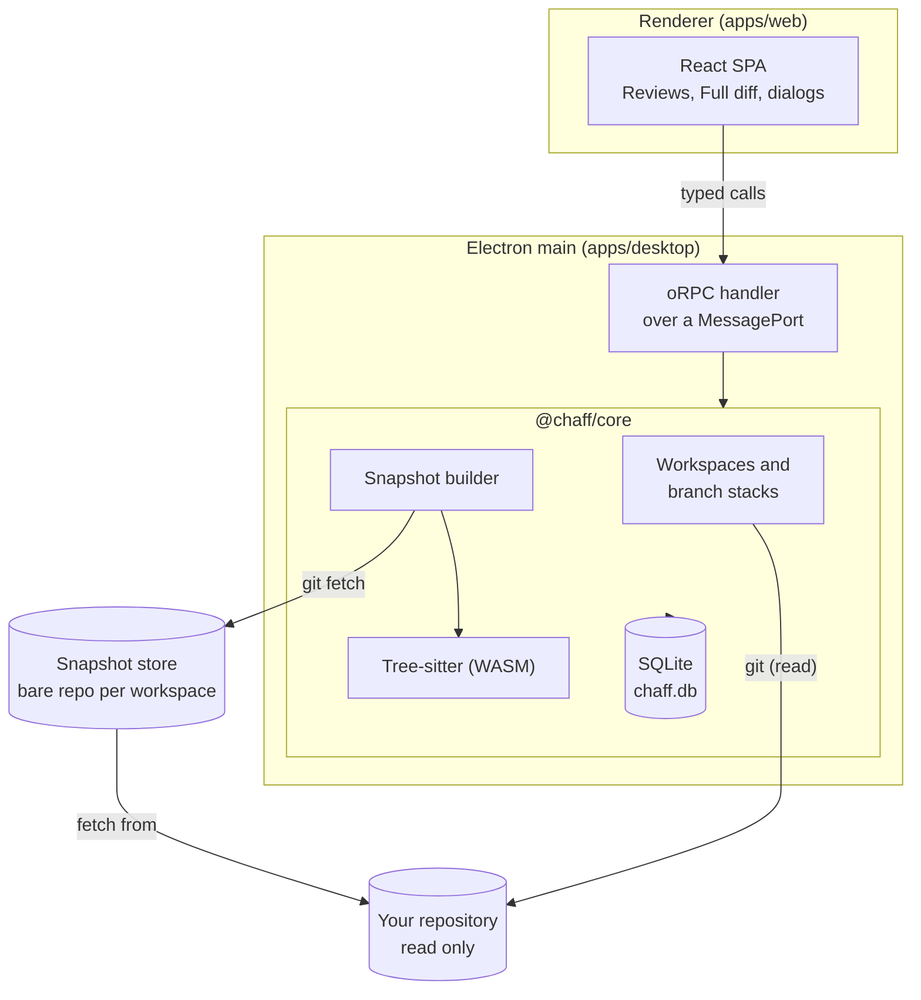

# How Chaff works

This page describes what runs today. Parts of the design that are not built yet are marked **planned**; the [README](../README.md#what-works-today) has the full list.

## The pieces

- **Renderer.** A React single-page app. It never touches Node, the file system or git; everything goes through typed calls to the core. It runs sandboxed with context isolation and a strict Content Security Policy, and is served from Chaff's own `chaff://app/` scheme.
- **Bridge.** The preload script hands the renderer one end of a `MessageChannel`. The main process checks that the sender is Chaff's own page, then serves the core's oRPC router over that port. Calls and their errors are typed by the contracts in `packages/server-contract`.
- **Core.** `@chaff/core` is a plain TypeScript library with no Electron imports, bundled into the main process. Anything that needs the OS (picking a folder, opening a link, applying the native theme) goes through a small host interface the desktop app provides, which keeps a later self-hosted web mode possible without a rewrite.
- **SQLite.** One database file in the app data folder holds workspaces, review targets, snapshots, regions, units and settings. It uses Node's built-in `node:sqlite` through Drizzle ORM, so there are no native modules to rebuild for Electron.

## Repositories are read, never written

Adding a repository stores its path and default branch. From then on Chaff runs your installed `git` against it with read-only commands such as `for-each-ref`, `rev-list`, `rev-parse` and `merge-base`, and the snapshot store fetches from it. It does not check out branches, add refs, touch the index or the stash, or write anywhere inside the repository.

## Finding stacks

Chaff lists your local branches and suggests a parent for each one:

- It walks the branch's first-parent history and takes the nearest commit that is the tip of another local branch.
- At the branch's own tip, only the default branch or an alphabetically earlier branch can be the parent, so two branches pointing at the same commit don't claim each other.
- Ties go to the branch's upstream setting. A branch with no other branch in its history stacks on the default branch.

Branches that chain this way form a stack, shown on the Reviews screen as `feature/async-input <- feature/job-options <- feature/consent`. Each branch is reviewed against its parent, so you read only what that branch adds. Editing parents by hand and a cumulative view of the whole stack are **planned** for the Stack overview.

## Snapshots

Starting a review freezes a **snapshot** of one branch against its parent:

1. Chaff fetches the branch and its parent from your repository into its own **snapshot store**, a bare git repository per workspace at `<app data>/stores/<workspace id>.git`.
2. It records three commits: the branch head, the parent head and their merge base. The diff is always merge base to branch head.
3. It pins those commits under `refs/chaff/snapshots/<snapshot id>/{head,parent,base}` in the store, so rebasing, force-updating or deleting the branch in your repository never breaks a review, and git's garbage collection can't remove them.

While you review, Chaff compares the snapshot with your repository and reports what moved: new commits on the branch, a rewritten branch (its old head is no longer in its history), a parent that moved, or a deleted branch. Nothing under the review changes until you press **Update**, which freezes a new snapshot of the same target. Comparing the two snapshots (interdiffs, keeping marks on unchanged code, re-anchoring findings) is the **planned** second pass.

## Regions and units

Each snapshot is broken down before you read it:

- A **region** is one contiguous changed range in one file, with a content hash. Every changed line belongs to exactly one region. Changes without line content (binary files, renames, mode changes) get one file-level region, so they are counted too.
- A **unit** is something you review. Chaff parses the old and new version of each file with tree-sitter and assigns each region to the declaration that encloses it: a function, method, class or other declaration becomes a **Function** unit, shown whole. Changes outside any declaration (imports, top-level statements, config, deleted, generated or unsupported files) become **Section** units. Nothing is dropped for being small or uninteresting.
- Supported grammars: TypeScript, TSX, JavaScript, Python, Go, Rust, Java, C#, Ruby, PHP, C++, Bash and PowerShell.

Units are numbered across the snapshot in reading order, and their count shows on the Reviews screen. Reviewing them one at a time, with marks and coverage over every region, is the **planned** Focus review. **Change** units (groups of regions that make one behavior change, proposed by an optional AI digest or made by hand) are also **planned**.

## Reading order

Files in the Full diff are sorted so that what other code depends on comes first:

1. Types, interfaces, contracts and schemas.
2. Source files, each followed by its tests.
3. Config, then docs, then generated files, then binaries.

Generated files, lockfiles and very large diffs stay collapsed until you ask for them.

## Where data lives

| What | Where |
| --- | --- |
| Database | `<app data>/chaff.db` |
| Snapshot stores | `<app data>/stores/<workspace id>.git` |
| Logs | the OS log folder for Chaff, `chaff.log` |

`<app data>` is `%APPDATA%\Chaff` on Windows, `~/Library/Application Support/Chaff` on macOS and `~/.config/Chaff` on Linux. Development runs (`pnpm run dev`) use a separate `Chaff Dev` folder. Reviews stay on that machine; export (**planned**) is the way to move them.

## Planned: GitLab, GitHub and the AI digest

- **GitLab merge requests** are the primary target: load an MR or a stack of MRs into the snapshot store, use MR diff versions as snapshots, and post findings back as draft notes you publish yourself.
- **GitHub pull requests** follow the same provider interface: import PRs and stacks, and export findings as a pending review that is never submitted automatically.
- **The AI digest** is optional and read-only. It uses the Claude Code or Codex already signed in on your machine, runs against a throwaway worktree of the snapshot in Chaff's data folder, and may only reference region ids, so it can group and explain changes but never hide one.
